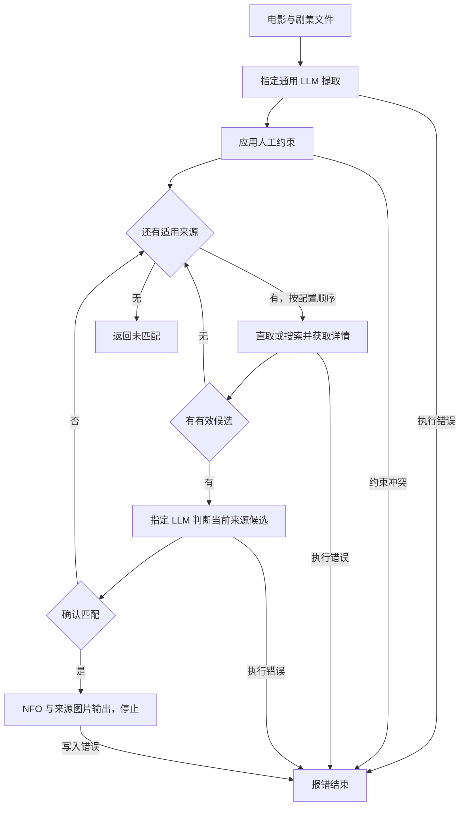

# 电影与剧集多数据源优化方案

本方案统一定义多 LLM、独立刮削配置、有序数据源处理和 NFO 输出，作为后续实施的唯一设计依据。项目只处理电影和剧集，生成面向 Jellyfin、Emby、Silo Server、Kodi 的 NFO 及配套图片。

本方案已在 `codex/metadata-providers` 工作区实施：具名多 LLM、独立刮削配置、顺序来源与完整候选获取、范围清理和 NFO 输出修复均已落地。按用户要求，四端读取采用官方文档与源码核查，不以本地测试冒充服务器实际导入。最终验证记录见 progress.md。

## 1. 目标与范围

成功标准是：文件对应正确作品和单集，元数据来自真实来源，同一份生成结果能被目标媒体软件正确识别与展示，错误不会被伪装为成功。

| 范围 | 确定方案 |
| --- | --- |
| 媒体类型 | 电影、电视剧及单集 |
| 元数据源 | TMDb 官方 API；TheTVDB 节目与单集 HTML，名称定位使用网站自身无需用户 API 密钥的公开搜索请求 |
| 识别 | 始终使用通用 LLM 分析文件名和目录上下文 |
| 候选判断 | 在刮削设置中按名称选择一个已配置的 OpenAI 兼容模型或 TypeSafe Jev；对当前来源的候选判断 |
| 产物 | 电影 NFO、节目 NFO、单集 NFO、来源图片 |
| 使用方 | Jellyfin、Emby、Silo Server、Kodi |
| 已移除能力 | 音乐视频、ffmpeg、ffprobe、媒体流探测、视频截图、旧匹配模式和搜索模式 |

电影目前只有 TMDb 实现；节目和单集有 TMDb、TheTVDB 两个实现。TheTVDB 网页抓取已接入有序刮削流程；不增加重复的同站来源。四种媒体软件是输出使用方，不是四个新的数据源。继续使用一个 NFO 写入模块，以已核实的读取契约确定字段和文件布局。

## 2. 唯一处理流程




1. **提取**：调用刮削设置指定的通用 LLM，获取标题、中文名、原名、年份、季集坐标、单集标题及来源定位线索。模型不生成最终简介、演员、评分等事实。
2. **约束**：人工指定来源、网站作品编号、季和分组优先约束可访问来源及候选。人工指定不跳过提取和判断，也不允许为继续尝试而忽略人工约束。
3. **取数**：按配置顺序访问来源，跳过不支持当前媒体类型或被人工约束排除的来源。有当前来源的作品编号则直接获取详情，没有则搜索。一个来源的编号不能定位另一个来源。
4. **判断**：取得当前来源的真实详情后，调用刮削设置指定的候选判断 LLM。节目与该来源的目标单集绑定，整体选择。即使只有一个候选也要判断。
5. **停止条件**：确认一个候选后立即停止，不访问后续来源。来源明确未找到，或模型明确未接受任何候选，才进入下一适用来源；全部用尽后返回未匹配。
6. **输出**：只写选中来源的 NFO 和图片。输入和输出路径由程序控制，模型不能指定输出位置。

请求超时、鉴权失败、限流、网页结构异常和模型响应格式错误属于执行错误，不当作未匹配继续尝试来源。模型也不会自动切换另一个配置实例。

例如来源顺序为 TheTVDB、TMDb：剧集先获取 TheTVDB 候选并判断，确认后结束；未匹配才处理 TMDb。电影因 TheTVDB 尚不支持而直接处理 TMDb。只有 TMDb 的 LLM 定位线索也不会越过排在前面的 TheTVDB；人工限定 TMDb 则只访问 TMDb。

搜索仍是获取未知作品位置的必要动作；移除的是可切换的搜索策略配置，不是搜索能力。顺序由程序执行，不作为可被模型忽略的提示词偏好。

端到端行为核对：

| 输入或结果 | 后续动作 | 输出边界 |
| --- | --- | --- |
| 来源不支持当前媒体类型 | 不请求该来源，继续顺序列表 | 尚未写入 |
| 当前来源已有作品定位线索 | 直接获取该来源详情，不先执行名称搜索 | 编号经真实详情核验后才可使用 |
| 当前来源明确无候选 | 进入下一适用来源，不调用空候选判断 | 尚未写入 |
| 判断模型确认候选 | 停止来源遍历，输出该候选 | 后续来源零请求 |
| 判断模型拒绝或 Jev 未达门槛 | 进入下一适用来源，沿用所选判断实例 | 不自动换模型 |
| 全部适用来源用尽 | 返回未匹配 | 不覆盖已有 NFO |
| 提取、来源、判断执行错误或人工约束冲突 | 报错结束 | 不伪装为未匹配 |
| 输出阶段失败 | 返回失败 | 单文件原子性，已成功写入的其他文件不自动回滚 |

## 已批准的范围清理

- 删除 Kodi JSON-RPC 全部代码及配置。顶层 kodi 原定义服务地址、账号和远程操作参数；collector.cron_scan_kodi 原控制扫描后通知。它们与生成 NFO 无关，用户已确认移除。
- 删除无生产调用的旧文件名规则、词典、正则、旧缓存过期算法及旧查询拼接工具，不保留规则回退路径。
- 删除 Show 中旧规则专用字段：Format（清晰度标签）、VideoCoding/AudioCoding（编码标签）、Source（片源标签）、Studio（文件名发行标签）、Channel（发行渠道）、Crew（制作组）、DynamicRange（动态范围标签）；这些字段不参与当前 LLM 和来源流程，不影响来源提供的演员、公司或语言事实。
- 删除 collector.movies_nfo_mode（原声明的电影 NFO 命名模式，未控制输出路径）和示例 filter_tmp_suffix（已无配置字段的开关）。
- 保留 collector.skip_keywords（文件名过滤关键词）、collector.tmp_suffix（排除的临时文件后缀），修复它们未被扫描与监听读取的问题，两条入口使用相同排除规则。
- 原盘支持、人工来源及季集/分组设置、目录过滤、定时扫描、监听、响应缓存和有限重试保留。

## 3. 模块职责


| 现有模块 | 职责 |
| --- | --- |
| `collector`、`media_file` | 扫描、监听、文件类型识别、任务派发 |
| `movies`、`shows` | 电影和剧集流程、输出路径、人工约束装配 |
| `common/ai` | OpenAI 兼容客户端实例，分别承担提取或判断；每个实例持有自己的配置，避免全局配置串用 |
| `tmdb`、`thetvdb` | 搜索、详情抓取、来源数据规范化，不调用模型、不自行决定最终候选 |
| `metadata` | 来源引用、事实记录、当前来源的候选集合、缓存、顺序调度及统一判断接口 |
| `common/jev` | TypeSafe System One 协议、Choice/Noul 响应校验 |
| `providers` | 按刮削设置解析模型名称、构造独立客户端、提取器、判断器及有序来源，注入处理链 |
| `nfo`、`artwork` | 将所选事实写入 NFO，下载并保存来源图片 |
| Kodi JSON-RPC | 按用户确认整套移除；保留 Kodi 对 NFO 的读取能力，不再主动控制媒体库 |

保持现有包边界，不为两个来源和两种模型协议新增插件框架、字段合并引擎或四套写入器。提取和判断可引用同一个 OpenAI 兼容实例，也可引用不同实例；不能在运行时修改全局配置来切换模型。

## 4. 身份与候选契约

以下是已实现的数据定义；它们解决不同来源、不同对象可能使用相同数字编号的问题。

| 字段或结构 | 定义与归属 |
| --- | --- |
| `Ref.Provider` | 网站来源名称，例如 `tmdb`、`thetvdb` |
| `Ref.Kind` | 被引用对象类型：`movie` 为电影，`show` 为节目，`episode` 为单集 |
| `Ref.ID` | 该来源、该对象类型内的记录编号，使用字符串；不能脱离前两项解释 |
| `Ref.Slug` | TheTVDB 节目页面的路径片段，只负责网页定位 |
| `Record.Ref` | 当前事实记录自身的来源引用；单集使用单集自己的引用 |
| `Record.ExternalIDs` | 网站明确提供的同一对象在其他网站的编号；每项包含网站类型与编号值 |
| `Record.SourceURL` | 当前事实记录的来源页面地址 |
| `Option.Work` | 一个候选的电影详情或节目详情 |
| `Option.Episode` | 节目候选绑定的同来源目标单集详情；电影候选没有该项 |
| `Request.Hints` | LLM 提供的未验证来源引用，只用于定位，必须获取真实详情后核验 |
| `choice` | 通用 LLM 判断响应中的当前来源、本次请求的候选键，例如 `c0`；`none` 表示拒绝全部候选。候选键不是网站记录编号 |

通用 LLM 响应中的 `tmdb_id` 表示电影或节目在 TMDb 的记录编号；`thetvdb_id` 表示节目在 TheTVDB 的记录编号。两者使用正整数字符串，未知留空，不能填演员、季或单集编号。它们不会未经验证就写入 NFO。

季集坐标未知时保持 `null`；季号 `0` 表示特别篇，不能当成未知。已有 `join.txt` 表示用户指定的季集坐标换算，`group.txt` 表示 TMDb Episode Group 的分组记录编号；这些约束不能制造原本未知的集号。

不按字段跨来源混合，不让 AI 填补来源缺失的事实。只有网站确认的同对象跨站编号才能随选中记录保留。

## 5. 数据获取与候选覆盖

### 已实现

- TMDb 使用官方 API 获取电影、节目和单集事实。
- TheTVDB 使用节目网页、官方播出顺序列表和单集网页；通过节目编号直取时无需先名称搜索。
- 两来源均有超时和明确错误传播；TheTVDB 有请求间隔、响应大小限制与网页结构校验。
- 当前实现按第 2 节逐来源获取、判断、确认即停止，没有跨来源汇总模式开关。
- 来源明确未找到可排除该候选；来源请求失败、鉴权失败、限流和结构异常不视为空结果。
- 同一季集坐标对应不同 TheTVDB 单集时明确报歧义；人工指定作品与分组冲突时明确报错。

### 已实现的候选覆盖边界

按 Title、ChineseTitle、OriginalTitle 去空白、去重形成明确查询集合；TMDb 保留每个标题带年份与无年份的查询变体，TheTVDB 用各标题查询公开搜索请求。收集各查询全部分页，按来源对象编号去重，不在来源内部选出赢家。

每页必须提供有效页码、页数和总条数；TheTVDB 还必须提供页容量及 exhaustiveNbHits=true。总数变化、重复无进展、计数不一致、结构缺失都报错，不把部分结果当成完整候选。单查询原始条数与合并后的唯一候选均不得超过 254；超限要求缩小定位信息。

搜索接口/分页的 HTTP 404 表示搜索故障，不转成未匹配；详情对象的 404 仍表示对象不存在。新缓存键及封装版本为 3，旧首屏缓存不会被复用为完整集合。

已覆盖第二页正确候选、多个标题、跨页重复、空列表、分页异常、254/255边界及后续页面/标题故障；编号直取仍不调用名称搜索。

## 6. 具名多 LLM 与独立刮削配置

模型定义只描述可调用实例；刮削设置描述本次业务任务如何使用这些实例和数据源。以下配置已接入当前程序；完整可运行结构见 [example.config.json](../example.config.json)，旧结构明确拒绝，不维护兼容分支。

### 模型列表

新增 `llms`：具名模型配置列表，用于允许多个相同或不同协议的模型实例共存，替代单份全局模型配置。

| 字段 | 定义与新增原因 |
| --- | --- |
| `llms[].name` | 用户定义的模型实例唯一名称，供刮削设置引用；不是服务端模型名称。新增以区分多个地址、账号或模型实例 |
| `llms[].type` | 调用协议类型，允许 `openai`、`jev`；新增以选择正确协议及任务能力。`openai` 指 OpenAI 兼容聊天补全协议，不限定服务商 |
| `llms[].base_url` | 该实例的服务地址；从原单份配置迁入，避免不同实例共用地址 |
| `llms[].api_key` | 该实例的访问凭据；从原单份配置迁入，凭据只能随对应实例的请求使用 |
| `llms[].model` | 传给该服务的模型名称；与供用户引用的 `name` 分离 |
| `llms[].proxy` | 该实例的请求代理，保持现有独立网络设置能力 |
| `llms[].timeout_seconds` | 该实例的秒级请求超时，保持现有默认 30 秒的行为 |
| `llms[].temperature` | OpenAI 兼容实例的采样温度，类型为 `jev` 时不允许设置，以免把无效参数伪装成生效 |

OpenAI 兼容实例可用于提取和候选判断。Jev 仅用于候选判断，调用 `/v1/systemone`，不能用来执行通用文件信息提取。每个 Jev 实例仍是显式凭据优先，未填写时按现有约定读取 `TYPESAFE_API_KEY`；多账号应分别填写实例凭据，不能靠切换进程环境区分账号。

### 刮削设置

新增独立 `scraper` 对象，集中存放来源选择、模型任务分工、事实缓存和 NFO 输出开关；连接参数仍属于各模型或数据源。

| 字段 | 定义与新增或迁移原因 |
| --- | --- |
| `scraper.providers` | 启用来源的有序列表，当前允许 `tmdb`、`thetvdb`；同时决定启用范围和逐来源执行顺序，替代原无优先级集合 |
| `scraper.extract_llm` | 执行文件名与目录信息提取的模型实例名称，引用 `llms[].name`；新增以允许单独选择提取模型，只能引用 `openai` 类型 |
| `scraper.select_llm` | 从当前来源的真实候选中选择作品的模型实例名称，引用 `llms[].name`；新增以允许选择任一 `openai` 或 `jev` 实例 |
| `scraper.cache_hours` | 来源事实缓存有效小时数，`0` 禁用磁盘响应缓存；迁入以归属于刮削行为 |
| `scraper.jev_match_threshold` | Jev 候选确认的最低 Noul 匹配概率，默认 `0.8`；从模型配置迁入，因为这是刮削接受标准，不是服务连接参数。仅所选判断实例类型为 `jev` 时读取及校验 |
| `scraper.nfo_field.tag` | 是否将已有类型信息写为 NFO 标签，保持现有布尔语义；从扫描配置迁入输出职责 |
| `scraper.nfo_field.genre` | 是否将类型信息写为 NFO 分类，保持现有独立布尔语义；从扫描配置迁入输出职责 |

`collector` 继续管理目录、扫描、监听和文件过滤；`tmdb`、`thetvdb` 继续管理各自接口地址、语言、凭据及网络参数。本次不再引入另一套来源启用开关或来源权重。

目标配置片段：

```json
{
  "llms": [
    {
      "name": "media-extract",
      "type": "openai",
      "base_url": "https://llm.example.com/v1",
      "api_key": "YOUR_EXTRACT_KEY",
      "model": "YOUR_EXTRACT_MODEL",
      "timeout_seconds": 30,
      "temperature": 0.2
    },
    {
      "name": "general-select",
      "type": "openai",
      "base_url": "https://llm.example.com/v1",
      "api_key": "YOUR_SELECT_KEY",
      "model": "YOUR_SELECT_MODEL",
      "timeout_seconds": 30,
      "temperature": 0.2
    },
    {
      "name": "jev-select",
      "type": "jev",
      "base_url": "https://api.typesafe.ai/v1",
      "api_key": "YOUR_TYPESAFE_KEY",
      "model": "jev-latest",
      "timeout_seconds": 30
    }
  ],
  "scraper": {
    "providers": ["thetvdb", "tmdb"],
    "extract_llm": "media-extract",
    "select_llm": "jev-select",
    "cache_hours": 24,
    "jev_match_threshold": 0.8,
    "nfo_field": {"tag": true, "genre": true}
  }
}
```

将 `select_llm` 改为 `general-select` 即改用对应的 OpenAI 兼容实例；改为 `media-extract` 则提取和判断共用该实例，但仍是两个不同任务的调用。单纯定义模型不会触发调用。

### 校验及判断规则

- 模型名称非空且唯一，类型必须受支持；提取和判断引用都必须显式存在，不能取列表第一项充当默认模型。
- 来源列表非空、没有重复或未知来源；列表顺序由程序严格执行。
- 显式代理地址无效时必须报错，不得静默直连；错误内容不包含代理凭据。
- 启动时校验被引用实例的必需连接参数及任务能力；不会因为未选择的 Jev 实例缺少凭据而阻止使用 OpenAI 兼容实例。
- Jev 使用 Choice 选择候选，Noul 判断候选是否对应输入。Choice 的相对区分置信度不代替 Noul 匹配概率。
- 通用 LLM 仅返回当前来源候选键或 `none`，不套用 Jev 门槛，不使用自报概率。
- `none` 或 Jev 所选候选未达到 Noul 门槛，表示当前来源未确认匹配，可按来源顺序继续；响应格式错误、非法候选键和请求故障立即报错。
- 两类判断器使用相同的原始文件上下文、人工约束和当前来源的紧凑事实，拒绝模型生成元数据。

### 旧字段处理

| 移除或迁移项 | 原含义及调整原因 |
| --- | --- |
| 顶层 `ai`、`jev` | 原单份通用模型和 Jev 配置；用 `llms` 的独立实例替换，解决只能各配置一个模型的问题 |
| `metadata.judge` | 原 `jev/llm` 类型开关；由 `scraper.select_llm` 引用具体实例替代，类型从实例定义获得 |
| `metadata.providers` | 原启用来源集合；迁入 `scraper.providers`，并改为有序执行 |
| `metadata.cache_hours` | 原事实缓存时长；迁入 `scraper.cache_hours` |
| `jev.match_threshold` | 原 Jev 匹配门槛；迁入 `scraper.jev_match_threshold`，归属于刮削接受规则 |
| `collector.nfo_field` | 原写在扫描配置内的 NFO 标签、分类开关；迁入 `scraper.nfo_field` |

上述迁移完成后删除旧顶层模型和 `metadata` 配置结构；旧配置应明确报错，不同时维护新旧入口。此前已移除的匹配/搜索模式、AI 启用开关、自报置信度门槛、外部媒体工具配置和音乐视频目录继续保持移除。

## 7. 面向四种媒体软件的 NFO 契约

### 输出原则

- 电影使用 `<movie>` 根元素，节目使用 `<tvshow>`，单集使用 `<episodedetails>`。
- `uniqueid` 表示当前 NFO 对象在指定网站的记录编号，`type` 标明网站，唯一一个 `default` 标记主要来源。节目编号不能替代单集编号。
- 标题、简介、日期、类型、演员、评分等只来自选中记录；未知可选字段不编造。
- `runtime` 是来源标称时长，单位为分钟。它不代表实际文件播放时长。电影与单集均只输出来源提供的正数标称时长，未知省略。
- 不输出 `fileinfo/streamdetails`，该结构描述实际文件的视频、音轨和字幕流；本项目不再采集这类信息。
- 配套图片来自选中来源。电影海报、节目海报与单集缩略图按对象分别保存。

### 已纳入的字段修复

以下三项已通过统一写入器修复，并有直接 XML 与受控 CLI 回归；不增加输出模式或新旧字段并存路径。

| 对象与字段 | 字段定义和问题 | 确定修改 | 验收条件 |
| --- | --- | --- | --- |
| 电影、单集 `runtime` | 来源标称时长，单位为分钟；内部 `Record.RuntimeMinutes` 保存这一事实。基线只映射单集，电影数据曾被遗漏 | 电影和单集均在来源时长大于 0 时输出；未知或无效非正值省略。节目级 NFO 不用平均单集时长冒充整部节目时长 | 电影输入 123 分钟输出 123；单集输入 45 分钟仍输出 45；未知时长均省略，不生成固定值、不读取媒体文件 |
| NFO `languages` | 基线将来源作品语言列表写成重复的该标签，但所核查四端没有相应读取映射 | 删除 NFO 写入结构及映射中的该字段，原因是无效序列化；保留来源记录和缓存中的语言事实。不自动替换为 `language`，后者在 Jellyfin/Emby 表示首选元数据语言 | 来源记录包含中文、英文时，NFO 不生成 `languages` 或替代的 `language`；来源事实本身不被修改 |
| 节目根元素 `tvshow` 下的 `season`、`episode` | Kodi 对这两个节目级字段的定义是媒体库实际季数、集数；基线曾写入网站统计的全节目数量 | 删除节目 NFO 的这两个数量赋值，原因是项目不能据来源记录确认用户实际持有数量，由媒体软件统计。内部来源计数继续保留 | 网站记录包含 2 季、12 集时，节目 NFO 不输出这两个数量字段；单集 NFO 的季集坐标仍正确输出 |

特别注意：单集根元素 `episodedetails` 下的 `season`、`episode` 分别表示当前单集的季号和集号，与节目级数量不是同一含义。它们必须保留，特别篇的季号 `0` 也必须保留，不能因为删除节目级数量而一并移除。

### 保留字段与读取端边界

- `uniqueid` 继续标识当前电影、节目或单集在指定网站的记录，保留网站明确提供的同对象跨站编号及唯一主要引用；不得把节目编号复制到单集。
- 当前单条 `ratings/rating` 表示选中来源的评分，已核实可读取；缺少默认属性不是本次阻断问题，不新增多评分合并或排序规则。
- `namedseason` 表示季号对应的季名称，演员 `thumb` 表示演员图片地址；保留这些已有正确含义的扩展字段。部分读取端忽略它们，应在字段矩阵中说明，不通过伪造别的字段补偿。
- `title`、`plot`、日期、演员角色以及分类和标签开关继续保持既有职责，三个根元素的字段修复不能串到其他对象。
- Silo 没有把单集网站编号传到最终结果，属于已核查读取端的能力边界；本项目仍输出正确的单集引用，不承诺通过修改 XML 消除该限制。

### 字段修复执行与验证

已先在 `nfo/write_test.go` 建立失败回归，再调整 `nfo/write.go`；原先要求节目 NFO 等于网站总集数的错误断言已替换。

执行链路验证为：来源提供带单位的时长、语言及数量事实 → `Record` 保留这些事实 → 写入器按电影/节目/单集选择有效字段 → 序列化与 XML 解析 → 对照四端官方读取契约。只有 NFO 输出映射发生变化，来源获取、判断器和缓存不变。

验证覆盖电影、节目、普通单集和特别篇：检查三项修复、中文/XML 转义、对象自身网站编号、原子写入及独立分类/标签开关。电影和剧集的受控 CLI 回放需再次通过，以确认来源事实最终到达正确的 NFO 对象。四端字段接受行为沿用官方文档与源码核查方式，不把本项目 XML 回归描述成服务器实际导入。

### 当前布局与验收重点


| 对象 | 当前普通文件布局 | 后续验证 |
| --- | --- | --- |
| 电影 | 与视频同名的 `.nfo`；同名前缀海报、背景图 | 四端能发现 NFO，正确读取身份、日期、评分与图片 |
| 节目 | 节目目录 `tvshow.nfo`、海报与背景图 | 节目归集、同对象跨站编号、元数据刷新 |
| 单集 | 与视频同名的 `.nfo` 和 `-thumb.jpg` | 季集归属、特别篇、单集编号及标称时长 |
| 原盘目录 | 电影根目录 movie.nfo，加对应 BDMV/index.nfo 或 VIDEO_TS/VIDEO_TS.nfo，内容相同 | 满足已核查的现行文件发现位置；不推断服务器的原盘播放能力 |

官方文档与源码的字段矩阵及修复记录见 [四端 NFO 核查报告](nfo-recognition-audit.md)。电影时长、无效语言标签、错误节目数量、Silo Logo 命名和原盘入口/路径已整改；当前单条评分可读，没有增加不必要的评分格式分支。不能把某个软件忽略字段等同于它支持了该字段，也不能只凭 XML 可解析宣称四端可用。

电影内部的 `NfoFiles` 定义该电影需要生成的 NFO 路径列表：普通视频只有同名 NFO；原盘在电影根目录及索引目录输出同一记录，原因是各读取端现行文件发现位置不同。所有位置仍使用一个写入器、单文件原子替换，不增加命名模式。普通电影 Logo 保存为 `<视频名>-logo.png`；NFO 同时用 `thumb` 的 `aspect="clearlogo"` 描述来源图片，供支持该标签的读取端使用。目录级原盘 Logo 保持 `clearlogo.png`。

文件命名仍是服务端归集的输入。尤其 Silo 的季集组织优先依赖目录和文件名；仅修改 NFO 内季集坐标不保证改变归属。验收应包含一个非标准命名样本并明确其输入边界，不自行增加批量重命名功能。

官方文档与源码支持“媒体流信息不是 NFO 的统一必需项”：Kodi 将其列为可选；Jellyfin 解析其中部分字段；本次核查的 Silo NFO 解析器未映射该结构。Emby 团队有自行探测媒体信息的说明，但属于较早资料，目标版本仍应实测。

## 8. 缓存、错误与文件安全

来源响应缓存在 `.metadata/cache/`，缓存身份包含来源配置、对象类型、来源引用、语言、分组和季集坐标。图片来源记录在 `.metadata/artwork/`。人工来源文件与已有人工文本设置不属于可清理响应缓存。

只缓存来源事实，命中缓存仍执行本轮提取和判断。TheTVDB 官方季集列表另有一小时进程缓存。保持当前边界，不在本轮新增模型判断缓存。

| 失败阶段 | 目标约束 |
| --- | --- |
| 提取失败、人工约束冲突、来源或模型请求/协议错误 | 返回错误；不进入 NFO 写入，也不作为未匹配跳到下一来源 |
| 当前来源无候选、模型明确拒绝或 Jev 未达到匹配门槛 | 按顺序尝试下一适用来源；不选首条、不生成事实、不切换模型；全部来源用尽才返回未匹配 |
| 单个 NFO 或图片写入 | 完整写入临时文件后替换目标，避免半文件覆盖 |
| 多个输出文件中的后续文件失败 | 返回错误，单次运行失败；此前已成功替换的文件可能保留，不宣称整组事务回滚 |
| Kodi 远程操作 | 不再提供扫描、刷新或清理调用，任务结果仅体现在输出和退出状态 |

当前流程先写 NFO，再保存图片；单文件原子替换不等于 NFO 与所有图片同时提交。验证和文档必须准确描述这个边界，不引入未要求的多文件事务系统。

## 9. 实施状态与验证边界

| 阶段 | 当前状态 | 证据 |
| --- | --- | --- |
| 范围清理 | 已实现 | Kodi RPC、外部媒体工具和音乐视频、旧规则与闲置配置清理；关键词/临时后缀过滤回归 |
| 多模型与刮削配置 | 已实现 | 双模型地址/凭据/模型隔离、未选实例不调用、严格配置及代理校验 |
| 来源顺序与分页 | 已实现 | 确认即停止、none/低Noul继续、搜索错误停止、完整分页/计数/超限及缓存版本回归 |
| NFO 与输出 | 已实现 | 电影/节目/单集/特别篇样本、字段保持、双位置原盘NFO、Logo及目录归属回归 |
| 全链路检查 | 已通过 | 15 个包、167 个测试函数、519 个节点；race、vet、四个构建目标、真实 CLI 受控回放及独立复核 |
| 四端读取 | 官方文档和源码已核查 | 已记录共同字段、扩展字段和原盘播放能力边界；未部署服务器 |

实现中的问题均按阶段复现、修复、验证：非法代理静默直连、搜索404误当无结果、原盘内部误派发、配置根祖先误判、全扫嵌套重复归属、相对根/spec子库漏扫。

读取规则的静态核查不代表所有历史版本或插件行为相同；源码级结论和实测结论分别记录。来源事实和模型协议使用受控服务完成回放，没有调用用户真实模型账户，也没有验证实际媒体库的识别准确率。TheTVDB 在本机 Go 直连连接阶段的历史问题仍需在用户部署网络检查，不通过改系统 DNS、代理或硬编码 CDN 掩盖。

整体审查还修复了相对节目根跨模块归属、畸形搜索候选、顶层 null 提取及 SOCKS 停滞握手的资源边界，补充了实际 CLI 和连接释放回归。

本轮未提交、合并或推送，改动保存在当前隔离工作区。完整验证计数及审查记录见 [progress.md](../progress.md)，四端契约见 [nfo-recognition-audit.md](nfo-recognition-audit.md)。

## 参考依据

- [Kodi 电影 NFO](https://kodi.wiki/view/NFO_files/Movies)、[单集 NFO](https://kodi.wiki/view/NFO_files/Episodes)。
- [Jellyfin 本地 NFO 文档](https://jellyfin.org/docs/general/server/metadata/nfo/)。
- [Silo 本地 NFO 契约，核查版本 d4e35ba](https://github.com/Silo-Server/silo-server/blob/d4e35ba9df416e747822c6c9f2193b89c6b7e9fb/docs/wiki/admin/nfo-local-metadata.md)。
- [Emby 团队关于媒体探测的说明，2016 年](https://emby.media/community/topic/33535-video-lenght-wrong-huge-episode-duration/)。
- [TypeSafe API](https://docs.typesafe.ai/api)、[Choice](https://docs.typesafe.ai/primitives/choice)、[Noul](https://docs.typesafe.ai/primitives/noul)、[Confidence](https://docs.typesafe.ai/confidence)。
