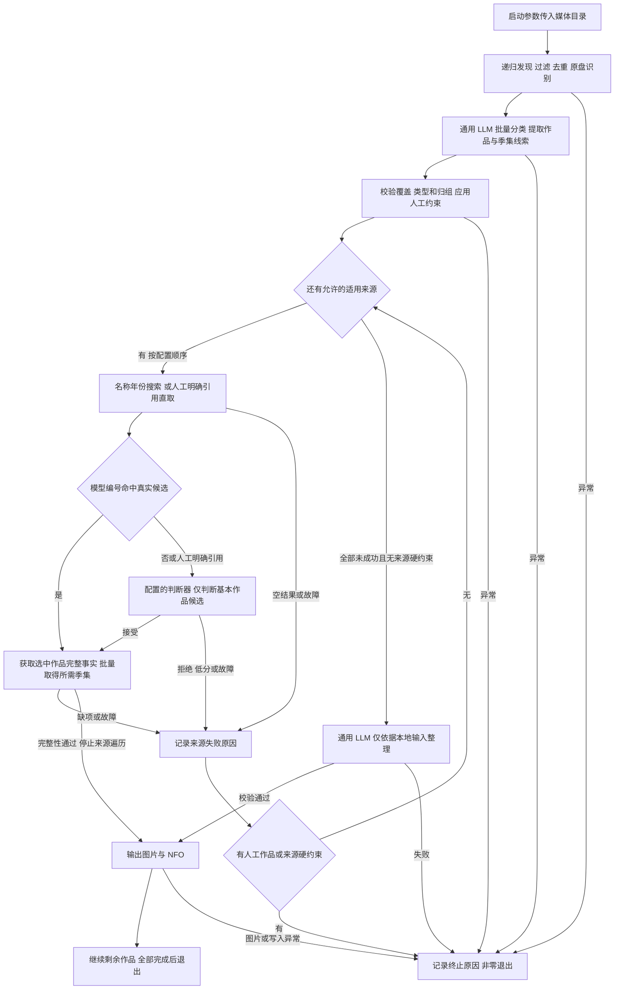

# 电影与剧集多数据源优化方案

本文记录一次性 CLI、AI 媒体分类、多 LLM、独立刮削配置、有序数据源处理、作品身份核验、确认后整剧批量取数、网站来源全部未成功后的 AI 本地整理和 NFO 输出契约。项目只使用电影和剧集两种组织形式，生成面向 Jellyfin、Emby、Silo Server、Kodi 的 NFO；有来源图片时保存配套图片。

具名多 LLM、一次性 `--path` 入口、批量分类、整剧任务、编号搜索核验和基本候选判断均已有实现。本轮只修正三方式接续：网站来源未成功继续下一方式，AI 本地整理也失败才以元数据获取失败退出。主分支接续修复与完整复验已完成，真实固定前三部 60 个视频通过；第四部暂时跳过，Friends 又因合并集协议限制停止，完整集合仍未验收。见 [复验记录](validation-2026-09-24.md) 与 [执行方案](superpowers/plans/2026-09-24-cleanup-series-batch-validation.md)。[批量能力实测](provider-batching-research.md)和四端官方文档/源码核查边界保持，未做服务器实际导入。

## 1. 目标与范围

成功标准是：有网站匹配时对应正确作品和单集；全部适用网站来源均未取得可用元数据时，仅按用户允许的本地输入整理信息并标明依据，未知事实留空。NFO 需符合目标媒体软件的读取契约，来源故障必须如实记录，不能伪装成网站无记录；AI 本地整理是否成功单独校验。

| 范围 | 确定方案 |
| --- | --- |
| 媒体类型 | 电影、电视剧及单集 |
| 元数据源 | TMDb 官方 API；TheTVDB 节目与单集 HTML，名称定位使用网站自身无需用户 API 密钥的公开搜索请求 |
| 入口 | 仅一次性执行，通过 --path 传入一个媒体目录，递归发现后处理并退出 |
| 识别 | 通用 LLM 批量判断电影/剧集、作品归属及季集；程序和配置不预设类型 |
| 候选判断 | 模型编号命中同来源、同对象类型的真实搜索候选时直接确认；否则由配置的 OpenAI 兼容模型或 TypeSafe Jev 判断基本作品候选；人工明确引用仍须判断 |
| 无匹配内容 | 全部适用网站来源均未取得可用元数据后，通用 LLM 仅依据目录和文件名整理本地元数据，不凭模型知识补写事实 |
| 产物 | 电影 NFO、节目 NFO、单集 NFO、来源图片 |
| 使用方 | Jellyfin、Emby、Silo Server、Kodi |
| 已移除能力 | 音乐视频、ffmpeg、ffprobe、媒体流探测、视频截图、旧匹配模式和搜索模式 |

电影目前只有 TMDb 实现；节目和单集有 TMDb、TheTVDB 两个实现。TheTVDB 网页抓取已接入有序刮削流程；不增加重复的同站来源。四种媒体软件是输出使用方，不是四个新的数据源。继续使用一个 NFO 写入模块，以已核实的读取契约确定字段和文件布局。

## 2. 当前处理流程



1. **发现与分类**：程序只扫描启动参数指定的目录，递归发现并去重媒体，不按目录预设电影/剧集。通用 LLM 每批最多处理 50 个媒体单元，返回类型、作品标题、原名/别名、年份、已知网站作品编号及明确季集；编号是未验证提示，未知留空，不强制编造。类型不明、漏项、路径越界或分组冲突均报错。程序校验后组织电影或整剧任务。
2. **人工约束**：人工来源、电影/节目记录引用以及季和分组约束保持原作用域。人工明确作品引用直取该来源的基本作品记录，并交给所选判断器做单候选判断；模型提示不能覆盖它。仅限定来源时仍在该来源搜索。人工指定未找到或冲突均终止进程。
3. **搜索核验**：没有人工明确作品引用时，按配置顺序访问适用来源，以提取片名及年份执行完整搜索；已知年份必须作为条件，不自动追加无年份搜索；即使模型给出作品编号也不能省略搜索。只在模型提示和真实候选的来源、电影/节目对象类型、记录编号三者完全相同时，直接确认该搜索候选并跳过判断器。不同来源或对象类型的编号不能相互命中。
4. **基本作品判断**：模型编号未知或未命中属于正常未核验提示；当前来源有候选时，把基本作品候选交给配置的 Jev 或通用判断模型。输入仅包含作品标题、原名、年份、对象类型和来源作品引用；不含完整文件清单、季集、分组、单集剧情、图库或演员。未被编号命中的单候选也必须判断，每个有候选的来源至多判断一次。
判断上下文中的 `ref` 表示人工指定的数据源及电影/节目记录引用；完全没有人工指定时不发送该字段，有实际约束时完整保留。候选自身的来源引用始终保留。输入的 `title`、`chinese_title`、`original_title` 都按片名线索理解，可能是不同语言的译名或别名，不要求同名字段逐字相等；候选事实、年份、类型和人工约束的校验规则不变。

5. **停止条件**：取得选中来源的完整可用元数据后才停止来源遍历。空搜索、判断拒绝、低分、来源/判断请求与解析故障、详情缺项均记录脱敏原因后尝试下一适用来源；全部网站来源未成功后进入 AI 本地整理。AI 整理也失败才以元数据获取失败退出；人工明确来源或作品限制不得被另一来源或本地结果绕过。
6. **确认后取数**：只获取选中来源的完整电影事实，或节目及本轮多季多集事实。节目确认前不获取候选季集；确认后保留既有批量接口、缓存、TMDb 每批 20 个追加对象限制及 TheTVDB 必要单集补取。批量失败或解析缺项结束当前来源尝试，继续下一允许来源，不能改走逐集请求。
7. **本地整理**：仅复用 `scraper.extract_llm` 指定的通用实例；`DescribeLocal` 每批最多处理 50 个输入路径，只返回由目录和文件名明确支持的标题、简介及分类，未知留空。季集坐标来自先前已校验分类结果或人工约束，程序生成本地对象标识。不调用 Jev 选择虚构来源。
8. **输出**：本轮映射和必需信息校验通过后，节目 NFO 与共有图片按整剧处理一次，单集 NFO 和缩略图按原视频路径输出。同一来源单集的多个本地版本共享事实；本地整理没有来源图片时不下载或生成图片。模型不能指定输出位置。

来源搜索、候选判断及完整事实获取阶段的超时、鉴权、限流、协议或解析错误，仅终止当前来源尝试，并记录后继续下一方式。共同输入/分类错误、人工硬约束冲突、用户取消和最终图片/NFO 输出错误仍终止进程。各来源失败由编排边界脱敏记录；最终终止错误由 collector 记录，main 只负责非零退出。不隐式重试、不切换模型、不承诺回滚已完成文件。

例如来源顺序为 TheTVDB、TMDb：剧集先尝试 TheTVDB，未取得完整可用元数据再尝试 TMDb，仍未成功才使用 AI 本地整理。电影因 TheTVDB 尚不支持而直接尝试 TMDb。只有 TMDb 的模型提示不会越过前面的 TheTVDB；人工限定 TMDb 则只允许 TMDb，不能换为 local。

搜索仍是模型作品提示交叉核验的必要动作；移除的是可切换的搜索策略配置，不是搜索能力。来源顺序和停止条件由程序执行，不交给模型决定。

端到端行为核对：

| 输入或结果 | 后续动作 | 输出边界 |
| --- | --- | --- |
| 缺少媒体路径或目录不可读 | 记录异常，整个进程非零退出 | 无模型/来源请求 |
| AI 类型未判定、覆盖不完整或目录归组冲突 | 记录异常，立即终止进程 | 无网站请求或 NFO 输出 |
| 同一目录混合电影和剧集 | 校验 AI 结果后分别组织作品任务 | 不由目录名字或样本答案决定类型 |
| 来源不支持当前媒体类型 | 不请求该来源，继续适用来源列表 | 尚未写入 |
| 人工明确电影/节目引用 | 直取基本作品记录并做单候选判断 | 不被模型提示覆盖；失败即终止 |
| 模型编号命中同来源、同类型真实搜索候选 | 直接确认，跳过判断器 | 搜索先于确认；只为选中作品获取完整事实 |
| 模型编号未知或未命中，但搜索有候选 | 配置的判断器判断基本作品候选 | 判断输入不携带季集或文件清单 |
| 当前来源搜索正常为空 | 进入下一适用来源，不调用空候选判断 | 尚未写入 |
| 判断模型确认候选 | 获取该候选完整事实，通过后停止来源遍历并输出 | 完整事实获取失败仍可尝试下一来源 |
| 判断模型拒绝、Jev 低于门槛或响应异常 | 记录当前来源原因，尝试下一允许来源 | 网站来源耗尽后执行 AI 本地整理 |
| 全部适用网站来源均未取得可用元数据 | 使用通用模型进行受限本地整理 | 输入覆盖、字段边界及本地身份校验通过后才写 NFO |
| 共同输入/提取校验、用户取消、人工约束或图片/NFO 输出错误 | 记录终止原因并非零退出 | 换来源无法解决；已完成文件不自动回滚 |

### AI 本地整理边界

本地描述请求只携带输入路径，模型仅返回标题、简介与分类，且这些内容必须由目录或文件名文本支持；未知简介、分类留空。已校验的分类结果和人工约束提供明确季集坐标，程序生成本地对象标识。模型不得依靠记忆生成具体剧情、出演名单、评分、时长、日期、制作信息、海报 URL 或网站编号。日期/年份标签不能直接当作首播日期。

本地整理使用程序生成的本地条目标识：`Ref.Provider=local` 表示本工具的本地命名空间，`Ref.ID` 此时标识本地电影/节目/单集对象，不是网站记录编号，也不由模型生成。节目由规范化目录与对象类型生成稳定摘要；明确单集由节目身份与季集坐标生成；独立视频由规范化文件路径与对象类型生成。同一路径重复运行稳定，不承诺移动或改名后不变。

本地 NFO 使用自定义 local 类型的唯一标识，不使用伪造的 tmdb、tvdb 或 imdb 类型编号；不创建假的来源页面地址。[Kodi 官方文档](https://kodi.wiki/view/NFO_files/TV_shows#nfo_Tags)允许非网站条目使用自定义类型，另外三端对这种输出的解析与忽略边界需要增加专项核查和样本。年度目录、独立专场和分段文件同样由 AI 判断电影或剧集；年份、日期、part 序号不能被程序机械转换成季集。用户确认的具体样本类型只作为验证期望，不进入生产分类规则或提示词。

网站来源失败与网站无记录是不同事实，日志必须区分。全部网站来源未成功后，AI 只按输入整理独立的 local 记录；不能把 AI 字段拼接到不完整网站记录，也不能宣称故障网站不存在该作品。共同输入冲突和人工硬约束仍终止。

## 已批准的范围清理

- 删除 Kodi JSON-RPC 全部代码及配置。顶层 kodi 原定义服务地址、账号和远程操作参数；collector.cron_scan_kodi 原控制扫描后通知。它们与生成 NFO 无关，用户已确认移除。
- 删除无生产调用的旧文件名规则、词典、正则、旧缓存过期算法及旧查询拼接工具，不保留规则回退路径。
- 删除 Show 中旧规则专用字段：Format（清晰度标签）、VideoCoding/AudioCoding（编码标签）、Source（片源标签）、Studio（文件名发行标签）、Channel（发行渠道）、Crew（制作组）、DynamicRange（动态范围标签）；这些字段不参与当前 LLM 和来源流程，不影响来源提供的演员、公司或语言事实。
- 删除 collector.movies_nfo_mode（原声明的电影 NFO 命名模式，未控制输出路径）和示例 filter_tmp_suffix（已无配置字段的开关）。
- 保留 collector.skip_keywords（用户明确指定的文件名排除关键词）、collector.tmp_suffix（排除的临时下载后缀）和 collector.skip_folders（排除目录名）；它们只控制明确过滤，不决定媒体类型。代码内凭 sample/trailer 等名字判定内容性质的逻辑移交 AI，不能因此新增未经明确的整类跳过策略。
- 原盘结构识别、人工来源及季集/分组约束、目录过滤和响应缓存保留；移除 `tmdb.retry_count`（原网络失败重试次数）及退避、重试统计，因为不对同一失败请求隐式重试，改由编排层尝试下一获取方式；定时扫描、文件监听和所有运行模式入口移除，具体字段及原因见第 6 节。

## 3. 模块职责


| 现有模块 | 职责 |
| --- | --- |
| `collector`、`media_file` | 一次性递归发现、明确过滤、路径去重、原盘结构识别；消费已校验的 AI 类型与作品归属后派发任务 |
| `movies`、`shows` | 电影和整剧流程、输出路径、节目与各目录人工约束装配；节目共有输出仅处理一次 |
| `common/ai` | OpenAI 兼容客户端实例，承担未预设类型的批量分类与提取、候选判断及受限本地整理；分类/提取/本地整理复用 extract_llm 指定实例 |
| `tmdb`、`thetvdb` | 搜索、批量详情获取、必要的单集字段补取及来源数据规范化，不调用模型、不自行决定最终候选 |
| `metadata` | 来源引用、事实记录、当前来源的候选集合、缓存、顺序调度及统一判断接口 |
| `common/jev` | TypeSafe System One 协议、Choice/Noul 响应校验 |
| `providers` | 按刮削设置解析模型名称、构造独立客户端、提取器、判断器及有序来源，注入处理链 |
| `nfo`、`artwork` | 将所选事实写入 NFO，下载并保存来源图片 |
| Kodi JSON-RPC | 按用户确认整套移除；保留 Kodi 对 NFO 的读取能力，不再主动控制媒体库 |

保持现有包边界，不为两个来源和两种模型协议新增插件框架、字段合并引擎或四套写入器。提取和判断可引用同一个 OpenAI 兼容实例，也可引用不同实例；不能在运行时修改全局配置来切换模型。

## 4. 身份与候选契约

以下是当前数据定义。来源、对象类型和记录编号必须共同解释，避免不同来源或对象使用相同数字编号时混淆。

| 字段或结构 | 定义与归属 |
| --- | --- |
| `Ref.Provider` | 网站来源名称，例如 `tmdb`、`thetvdb`；新增值 `local` 表示无网站匹配后的本地条目命名空间，不加入网站来源列表 |
| `Ref.Kind` | 被引用对象类型：`movie` 为电影，`show` 为节目，`episode` 为单集 |
| `Ref.ID` | 该来源、该对象类型内的记录编号，使用字符串；local 命名空间内改由程序按本地对象定位信息生成稳定摘要，避免伪造网站身份；不能脱离来源与对象类型解释 |
| `Ref.Slug` | TheTVDB 节目页面的路径片段，只负责网页定位 |
| `Record.Ref` | 当前事实记录自身的来源引用；单集使用单集自己的引用 |
| `Record.ExternalIDs` | 网站明确提供的同一对象在其他网站的编号；每项包含网站类型与编号值 |
| `Record.SourceURL` | 当前事实记录的来源页面地址 |
| `Candidate` | 判断阶段使用的基本作品候选，保留真实搜索记录或人工直取记录的来源引用、标题、原名和年份，不包含季集事实 |
| `Judge.Select` | 接收当前作品请求和 `[]Candidate`；替代原完整 `[]Option` 输入，原因是作品确认前不得把季集或完整详情作为判断证据 |
| `Option.Work` | 作品确认后的完整电影事实或节目事实，仅用于后续输出 |
| `Option.Episodes` | 作品确认后取得的同来源单集事实集合；已替代原只绑定一个单集的 `Option.Episode` 以支持整剧输出，不再作为判断输入 |
| `Request.Hints` | LLM 提供的未验证电影/节目来源引用；必须与同来源、同对象类型的真实搜索候选交叉核验，不能触发直取 |
| `choice` | 通用 LLM 判断响应中的当前来源、本次请求的候选键，例如 `c0`；`none` 表示拒绝全部候选。候选键不是网站记录编号 |

批量识别结果采用 `items` 条目列表：`items[].media_type` 表示 AI 判定的 movie（独立作品）或 tv（剧集单集），null 表示未判定且会被拒绝；`items[].relative_path` 引用本批输入媒体；`items[].series_root` 引用输入范围内现有的节目目录，仅 tv 使用。这些字段替代扫描前预设类型，支持混合目录及跨季归集。程序验证引用范围、唯一覆盖和同组身份，不让模型直接指定任意输出路径。完整字段定义见 [执行方案第 3 节](superpowers/plans/2026-09-24-cleanup-series-batch-validation.md)。

通用 LLM 返回的各条目中的 `tmdb_id` 表示电影或节目在 TMDb 的记录编号；`thetvdb_id` 表示节目在 TheTVDB 的记录编号。两者使用正整数字符串，未知留空，不能填演员、季或单集编号。模型可以根据明确标记或已有知识提供提示；提示必须命中同来源、同对象类型的真实搜索候选才可直接确认，未知或未命中则判断基本候选。它们不会未经验证就写入 NFO。

季集坐标未知时保持 `null`；季号 `0` 表示特别篇，不能当成未知。已有 `join.txt` 表示用户指定的季集坐标换算，`group.txt` 表示 TMDb Episode Group 的分组记录编号；这些约束不能制造原本未知的集号。

不按字段跨网站来源混合，不让 AI 填补已匹配来源缺失的事实。只有网站确认的同对象跨站编号才能随选中记录保留；本地整理记录的跨站编号集合和来源页面地址为空。

## 5. 数据获取与候选覆盖

### 来源能力与当前契约

- TMDb 使用官方 API 获取电影、节目和单集事实。
- TheTVDB 使用节目网页、官方播出顺序列表和单集网页；只有人工明确作品引用可以直取基本节目记录并接受判断，模型编号仍须先名称搜索。
- 两来源均有超时和明确错误传播；TheTVDB 有请求间隔、响应大小限制与网页结构校验。
- 来源按顺序搜索基本候选，经编号交叉核验或判断确认后才获取完整事实；整剧批量取数不参与候选判断，没有跨来源汇总模式开关。
- 当前来源空结果、判断拒绝/低分、HTTP/协议故障或选中详情无法完整获取，都结束该来源尝试并进入下一适用来源；网站来源全部未成功后进入受限 AI 本地整理。人工明确来源或作品失败不能绕过硬约束。
- 同一季集坐标对应不同 TheTVDB 单集时明确报歧义；人工指定作品与分组冲突时明确报错。

### 已实现的整剧批量取数

- TMDb 继续使用官方 API，从节目详情 API 追加涉及季的单集数组及所需单集扩展对象；演职员、图片及同对象跨站编号已实测可批量取得。每批最多 20 个追加对象，所有类型共同计数，超过上限分批，不限制节目总季数。
- 必须使用经实测有效的节目 API 组合路径。季 API 对同样的嵌套单集路径可能返回 HTTP 200 却省略对象，不能将成功状态码视为完整数据。
- TheTVDB 节目页、全集页按任务共用；本地涉及的每季页面只取一次。全集页获取标题、简介、日期、电视网和剧照，季页面补充各集时长，以网站单集记录编号及季集坐标核对合并。
- 匿名批量页面不能提供的目标语言翻译、单集跨站编号，才补取相应单集页；补取不重读节目页、不重复搜索或判断。
- 来源在内存中的快照仅在一次 CLI 运行内复用；磁盘缓存按 `scraper.cache_hours` 在不同运行之间复用，设为 `0` 即禁用磁盘复用。整剧批量结果使用独立的 `series-*` 缓存命名空间及自身键版本，不把旧单集响应当成完整集合，也不因批量处理统一提高旧响应封装版本。

能力证据与局限以 [平台实测报告](provider-batching-research.md) 为准；实施步骤与请求数量断言见 [执行方案](superpowers/plans/2026-09-24-cleanup-series-batch-validation.md)。

### 候选覆盖与身份核验边界

按 Title、ChineseTitle、OriginalTitle 去空白、去重形成明确查询集合。`Query.Year` 表示从输入提取的作品年份，已知时必须作为搜索条件，不追加无年份查询放宽范围；未知时才不限定年份。TMDb 电影使用 `primary_release_year`（电影首次发行年份），节目使用 `first_air_date_year`（节目首播年份）。TheTVDB 的服务端年份过滤尚未证实，因此先读取标题查询的完整分页，再按返回候选的作品年份核验：年份未知或与已知查询年份不同的候选不满足条件。查询结果按来源对象编号去重，不在来源内部选出赢家。

每页必须提供有效页码、页数和总条数；TheTVDB 还必须提供页容量及 exhaustiveNbHits=true。总数变化、重复无进展、计数不一致、结构缺失都报错，不把部分结果当成完整候选。单查询原始条数与合并后的唯一候选均不得超过 254；超限要求缩小定位信息。

搜索接口/分页的 HTTP 404 表示搜索故障；详情对象的 404 表示对象不存在。两者均结束当前来源尝试并记录原因，然后访问下一允许来源，不能转成正常空搜索。搜索缓存操作名 `identity-search-v1` 仅隔离旧的忽略或放宽年份的搜索结果；详情缓存和 `series-*` 整剧缓存版本不变，不迁移或删除旧缓存。完整分页校验继续保留。

TMDb 正常空第一页允许 `total_pages`（来源总页数）为 0 或 1，但 `total_results`（来源候选总数）必须为 0，且 `results` 必须为显式空列表。某个片名线索没有命中时继续收集其他名称结果，保留已找到的候选；缺字段、负数、后续空页或与非零结果数矛盾的响应仍报错并结束当前来源尝试，不使用部分结果。

历史回归已覆盖第二页正确候选、多个标题、跨页重复、空列表、分页异常、254/255 边界及后续页面/标题故障。本轮须复验：模型编号仍先搜索，已知年份不放宽，精确命中后零判断，未命中只判断基本候选；人工明确引用保留直取基本记录与单候选判断。身份核验契约已有受控回归与前两部真实样本证据；本轮接续规则已通过合并前后 race 与 vet：16 包、235 个测试函数、654 个节点；合并前四平台构建、合并后本机构建通过，Super.Science 真实运行也已通过。

## 6. 具名多 LLM 与独立刮削配置

模型定义只描述可调用实例；刮削设置描述本次业务任务如何使用这些实例和数据源。以下配置已接入当前程序；完整可运行结构见 [example.config.json](../example.config.json)，旧结构明确拒绝，不维护兼容分支。

### 唯一启动入口和目录配置移除

媒体目录只通过 --path 参数传入，且只接受一个；位置参数、重复 --path 和额外路径均拒绝。程序递归发现目录内所有支持且未明确排除的视频。没有路径或路径无效时失败，不默认扫描当前目录。`-config` 仍选择配置文件，`-version` 和帮助入口保留。

```sh
./kodi-tmdb -config config.json --path "/media/混合媒体库"
```

以下是已删除字段和参数的语义，供旧配置迁移时识别，不是兼容配置示例：

| 删除项 | 定义和移除原因 |
| --- | --- |
| `collector.movies_dir` | 原电影根目录数组；路径改从启动参数传入，类型改由 AI 分析 |
| `collector.shows_dir` | 原剧集根目录数组；路径改从启动参数传入，类型改由 AI 分析 |
| `collector.run_mode` | 原常驻/单次/当前目录模式编号；仅保留一次性执行，删除模式选择 |
| `-mode` | 原命令行运行模式覆盖参数；不再有模式可覆盖 |
| `collector.watcher` | 原文件监听开关；一次处理完即退出，删除监听 |
| `collector.cron_scan` | 原定时扫描开关；删除周期任务 |
| `collector.cron_scan_boot` | 原守护启动扫描开关；唯一入口启动即扫描，无需此开关 |
| `collector.cron_seconds` | 原扫描间隔秒数；删除定时循环 |

不增加曾建议的 `collector.media_dirs`（配置中的媒体根目录数组），因为路径只属于本次启动参数。旧字段严格拒绝，配置保留模型、来源、刮削、日志和明确过滤设置。日志输出模式不受运行模式删除影响。

### 模型列表


新增 `llms`：具名模型配置列表，用于允许多个相同或不同协议的模型实例共存，替代单份全局模型配置。

| 字段 | 定义与新增原因 |
| --- | --- |
| `llms[].name` | 用户定义的模型实例唯一名称，供刮削设置引用；不是服务端模型名称。新增以区分多个地址、账号或模型实例 |
| `llms[].type` | 调用协议类型，允许 `openai`、`jev`；新增以选择正确协议及任务能力。`openai` 指 OpenAI 兼容聊天补全协议，不限定服务商 |
| `llms[].base_url` | 该实例的服务地址；从原单份配置迁入，避免不同实例共用地址 |
| `llms[].api_key` | 该实例的访问凭据；从原单份配置迁入，凭据只能随对应实例的请求使用 |
| `llms[].model` | 传给该服务的模型名称；与供用户引用的 `name` 分离 |
| `llms[].proxy` | 该实例的请求代理，保持现有独立网络设置能力 |
| `llms[].timeout_seconds` | 该实例的秒级请求超时，保持现有默认 30 秒的行为 |
| `llms[].temperature` | OpenAI 兼容实例的采样温度，类型为 `jev` 时不允许设置，以免把无效参数伪装成生效 |

OpenAI 兼容实例可用于提取和候选判断。Jev 仅用于候选判断，调用 `/v1/systemone`，不能用来执行通用文件信息提取。每个 Jev 实例仍是显式凭据优先，未填写时按现有约定读取 `TYPESAFE_API_KEY`；多账号应分别填写实例凭据，不能靠切换进程环境区分账号。

### 刮削设置

新增独立 `scraper` 对象，集中存放来源选择、模型任务分工、事实缓存和 NFO 输出开关；连接参数仍属于各模型或数据源。

| 字段 | 定义与新增或迁移原因 |
| --- | --- |
| `scraper.providers` | 启用来源的有序列表，当前允许 `tmdb`、`thetvdb`；同时决定启用范围和逐来源执行顺序，替代原无优先级集合 |
| `scraper.extract_llm` | 执行媒体分类、作品/季集提取及受限本地整理的通用模型实例名称，引用 `llms[].name`；沿用该任务入口，只能引用 openai 类型 |
| `scraper.select_llm` | 从当前来源的真实候选中选择作品的模型实例名称，引用 `llms[].name`；新增以允许选择任一 `openai` 或 `jev` 实例 |
| `scraper.cache_hours` | 来源事实缓存有效小时数，`0` 禁用磁盘响应缓存；迁入以归属于刮削行为 |
| `scraper.jev_match_threshold` | Jev 候选确认的最低 Noul 匹配概率，默认 `0.8`；从模型配置迁入，因为这是刮削接受标准，不是服务连接参数。仅所选判断实例类型为 `jev` 时读取及校验 |
| `scraper.nfo_field.tag` | 是否将已有类型信息写为 NFO 标签，保持现有布尔语义；从扫描配置迁入输出职责 |
| `scraper.nfo_field.genre` | 是否将类型信息写为 NFO 分类，保持现有独立布尔语义；从扫描配置迁入输出职责 |

`collector` 配置只保留明确文件过滤；运行路径由启动参数提供，一次性执行无需开关。`tmdb`、`thetvdb` 继续管理接口地址、语言、凭据和网络参数，不引入另一套来源启用开关或来源权重。

当前配置片段：

```json
{
  "llms": [
    {
      "name": "media-extract",
      "type": "openai",
      "base_url": "https://llm.example.com/v1",
      "api_key": "YOUR_EXTRACT_KEY",
      "model": "YOUR_EXTRACT_MODEL",
      "timeout_seconds": 30,
      "temperature": 0.2
    },
    {
      "name": "general-select",
      "type": "openai",
      "base_url": "https://llm.example.com/v1",
      "api_key": "YOUR_SELECT_KEY",
      "model": "YOUR_SELECT_MODEL",
      "timeout_seconds": 30,
      "temperature": 0.2
    },
    {
      "name": "jev-select",
      "type": "jev",
      "base_url": "https://api.typesafe.ai/v1",
      "api_key": "YOUR_TYPESAFE_KEY",
      "model": "jev-latest",
      "timeout_seconds": 30
    }
  ],
  "scraper": {
    "providers": ["thetvdb", "tmdb"],
    "extract_llm": "media-extract",
    "select_llm": "jev-select",
    "cache_hours": 24,
    "jev_match_threshold": 0.8,
    "nfo_field": {"tag": true, "genre": true}
  }
}
```

将 `select_llm` 改为 `general-select` 即改用对应的 OpenAI 兼容实例；改为 `media-extract` 则提取和判断共用该实例，但仍是两个不同任务的调用。单纯定义模型不会触发调用。

### 校验及判断规则

- 模型名称非空且唯一，类型必须受支持；提取和判断引用都必须显式存在，不能取列表第一项充当默认模型。
- 来源列表非空、没有重复或未知来源；列表顺序由程序严格执行。
- 显式代理地址无效时必须报错，不得静默直连；错误内容不包含代理凭据。
- 启动时校验被引用实例的必需连接参数及任务能力；不会因为未选择的 Jev 实例缺少凭据而阻止使用 OpenAI 兼容实例。
- Jev 使用 Choice 选择候选，Noul 判断候选是否对应输入。Choice 的相对区分置信度不代替 Noul 匹配概率。
- 通用 LLM 仅返回当前来源候选键或 `none`，不套用 Jev 门槛，不使用自报概率。
- `none`、Jev 所选候选未达到 Noul 门槛、响应格式错误、非法候选键和请求故障，均记录当前来源未成功的原因后进入下一允许来源；网站来源耗尽后进入 AI 本地整理。人工硬约束仍必须满足。
- 模型编号命中同来源、同类型的真实搜索候选时跳过两类判断器；人工明确引用仍须判断。两类判断器均只接收作品标题、原名、年份、类型与来源引用，不携带文件清单、季集、分组、剧情、演员或图库。

### 旧字段处理

| 移除或迁移项 | 原含义及调整原因 |
| --- | --- |
| 顶层 `ai`、`jev` | 原单份通用模型和 Jev 配置；用 `llms` 的独立实例替换，解决只能各配置一个模型的问题 |
| `metadata.judge` | 原 `jev/llm` 类型开关；由 `scraper.select_llm` 引用具体实例替代，类型从实例定义获得 |
| `metadata.providers` | 原启用来源集合；迁入 `scraper.providers`，并改为有序执行 |
| `metadata.cache_hours` | 原事实缓存时长；迁入 `scraper.cache_hours` |
| `jev.match_threshold` | 原 Jev 匹配门槛；迁入 `scraper.jev_match_threshold`，归属于刮削接受规则 |
| `collector.nfo_field` | 原写在扫描配置内的 NFO 标签、分类开关；迁入 `scraper.nfo_field` |
| `tmdb.retry_count` | 原网络失败重试次数；删除，因为不对同一失败请求隐式重试，改由编排层尝试下一获取方式，同时移除退避和重试统计，旧字段严格拒绝 |

上述迁移完成后删除旧顶层模型和 `metadata` 配置结构；旧配置应明确报错，不同时维护新旧入口。此前已移除的匹配/搜索模式、AI 启用开关、自报置信度门槛、外部媒体工具配置和音乐视频目录继续保持移除。

## 7. 面向四种媒体软件的 NFO 契约

### 输出原则

- 电影使用 `<movie>` 根元素，节目使用 `<tvshow>`，单集使用 `<episodedetails>`。
- `uniqueid` 表示当前 NFO 对象在指定命名空间的唯一标识，`type` 标明网站或 local，本地类型的值由程序生成；唯一一个 `default` 标记主要引用。节目编号不能替代单集编号，本地编号不能冒充网站编号。
- 网站匹配路径的标题、简介、日期、类型、演员、评分等只来自选中记录；本地整理路径只输出第 2 节允许且由输入支持的信息；未知可选字段不编造。
- `runtime` 是来源标称时长，单位为分钟。它不代表实际文件播放时长。电影与单集均只输出来源提供的正数标称时长，未知省略。
- 不输出 `fileinfo/streamdetails`，该结构描述实际文件的视频、音轨和字幕流；本项目不再采集这类信息。
- 配套图片来自选中来源。电影海报、节目海报与单集缩略图按对象分别保存。

### 已纳入的字段修复

以下三项已通过统一写入器修复，并有直接 XML 与受控 CLI 回归；不增加输出模式或新旧字段并存路径。

| 对象与字段 | 字段定义和问题 | 确定修改 | 验收条件 |
| --- | --- | --- | --- |
| 电影、单集 `runtime` | 来源标称时长，单位为分钟；内部 `Record.RuntimeMinutes` 保存这一事实。基线只映射单集，电影数据曾被遗漏 | 电影和单集均在来源时长大于 0 时输出；未知或无效非正值省略。节目级 NFO 不用平均单集时长冒充整部节目时长 | 电影输入 123 分钟输出 123；单集输入 45 分钟仍输出 45；未知时长均省略，不生成固定值、不读取媒体文件 |
| NFO `languages` | 基线将来源作品语言列表写成重复的该标签，但所核查四端没有相应读取映射 | 删除 NFO 写入结构及映射中的该字段，原因是无效序列化；保留来源记录和缓存中的语言事实。不自动替换为 `language`，后者在 Jellyfin/Emby 表示首选元数据语言 | 来源记录包含中文、英文时，NFO 不生成 `languages` 或替代的 `language`；来源事实本身不被修改 |
| 节目根元素 `tvshow` 下的 `season`、`episode` | Kodi 对这两个节目级字段的定义是媒体库实际季数、集数；基线曾写入网站统计的全节目数量 | 删除节目 NFO 的这两个数量赋值，原因是项目不能据来源记录确认用户实际持有数量，由媒体软件统计。内部来源计数继续保留 | 网站记录包含 2 季、12 集时，节目 NFO 不输出这两个数量字段；单集 NFO 的季集坐标仍正确输出 |

特别注意：单集根元素 `episodedetails` 下的 `season`、`episode` 分别表示当前单集的季号和集号，与节目级数量不是同一含义。它们必须保留，特别篇的季号 `0` 也必须保留，不能因为删除节目级数量而一并移除。

### 保留字段与读取端边界

- `uniqueid` 继续标识当前电影、节目或单集在指定网站的记录，保留网站明确提供的同对象跨站编号及唯一主要引用；不得把节目编号复制到单集。
- 当前单条 `ratings/rating` 表示选中来源的评分，已核实可读取；缺少默认属性不是本次阻断问题，不新增多评分合并或排序规则。
- `namedseason` 表示季号对应的季名称，演员 `thumb` 表示演员图片地址；保留这些已有正确含义的扩展字段。部分读取端忽略它们，应在字段矩阵中说明，不通过伪造别的字段补偿。
- `title`、`plot`、日期、演员角色以及分类和标签开关继续保持既有职责，三个根元素的字段修复不能串到其他对象。
- Silo 没有把单集网站编号传到最终结果，属于已核查读取端的能力边界；本项目仍输出正确的单集引用，不承诺通过修改 XML 消除该限制。

### 字段修复执行与验证

已先在 `nfo/write_test.go` 建立失败回归，再调整 `nfo/write.go`；原先要求节目 NFO 等于网站总集数的错误断言已替换。

执行链路验证为：来源提供带单位的时长、语言及数量事实 → `Record` 保留这些事实 → 写入器按电影/节目/单集选择有效字段 → 序列化与 XML 解析 → 对照四端官方读取契约。只有 NFO 输出映射发生变化，来源获取、判断器和缓存不变。

验证覆盖电影、节目、普通单集和特别篇：检查三项修复、中文/XML 转义、对象自身网站编号、原子写入及独立分类/标签开关。电影和剧集的受控 CLI 回放需再次通过，以确认来源事实最终到达正确的 NFO 对象。四端字段接受行为沿用官方文档与源码核查方式，不把本项目 XML 回归描述成服务器实际导入。

### 当前布局与验收重点


| 对象 | 当前普通文件布局 | 后续验证 |
| --- | --- | --- |
| 电影 | 与视频同名的 `.nfo`；同名前缀海报、背景图 | 四端能发现 NFO，正确读取身份、日期、评分与图片 |
| 节目 | 节目目录 `tvshow.nfo`、海报与背景图 | 节目归集、同对象跨站编号、元数据刷新 |
| 单集 | 与视频同名的 `.nfo` 和 `-thumb.jpg` | 季集归属、特别篇、单集编号及标称时长 |
| 原盘目录 | 电影根目录 movie.nfo，加对应 BDMV/index.nfo 或 VIDEO_TS/VIDEO_TS.nfo，内容相同 | 满足已核查的现行文件发现位置；不推断服务器的原盘播放能力 |

官方文档与源码的字段矩阵及修复记录见 [四端 NFO 核查报告](nfo-recognition-audit.md)。电影时长、无效语言标签、错误节目数量、Silo Logo 命名和原盘入口/路径已整改；当前单条评分可读，没有增加不必要的评分格式分支。不能把某个软件忽略字段等同于它支持了该字段，也不能只凭 XML 可解析宣称四端可用。

电影内部的 `NfoFiles` 定义该电影需要生成的 NFO 路径列表：普通视频只有同名 NFO；原盘在电影根目录及索引目录输出同一记录，原因是各读取端现行文件发现位置不同。所有位置仍使用一个写入器、单文件原子替换，不增加命名模式。普通电影 Logo 保存为 `<视频名>-logo.png`；NFO 同时用 `thumb` 的 `aspect="clearlogo"` 描述来源图片，供支持该标签的读取端使用。目录级原盘 Logo 保持 `clearlogo.png`。

文件命名仍是服务端归集的输入。尤其 Silo 的季集组织优先依赖目录和文件名；仅修改 NFO 内季集坐标不保证改变归属。验收应包含一个非标准命名样本并明确其输入边界，不自行增加批量重命名功能。

官方文档与源码支持“媒体流信息不是 NFO 的统一必需项”：Kodi 将其列为可选；Jellyfin 解析其中部分字段；本次核查的 Silo NFO 解析器未映射该结构。Emby 团队有自行探测媒体信息的说明，但属于较早资料，目标版本仍应实测。

## 8. 缓存、错误与文件安全

来源响应缓存在 `.metadata/cache/`，缓存身份包含来源配置、对象类型、来源引用、语言、分组和季集坐标。搜索使用 `identity-search-v1` 操作名隔离旧年份条件结果；详情与整剧缓存版本保持不变。整剧批量结果使用独立的 `series-*` 命名空间和键版本，不需要仅因这一改动统一提高旧响应封装版本。图片来源记录在 `.metadata/artwork/`。人工来源文件与已有人工文本设置不属于可清理响应缓存。

只缓存来源事实，命中缓存仍执行本轮提取和作品核验；模型编号精确命中真实搜索候选时跳过判断，否则按基本候选判断契约执行；剧集的“本轮”是整剧任务，不是每个视频。来源在内存中的快照只在单次 CLI 运行内共用；`scraper.cache_hours` 控制跨次运行的磁盘缓存有效期，`0` 禁用磁盘缓存。批量路径保持来源与语言隔离，不缓存模型判断结果。

| 失败阶段 | 目标约束 |
| --- | --- |
| 共同输入/分类错误、人工硬约束、用户取消 | 记录终止原因并非零退出，不静默修改输入或约束 |
| 来源搜索/判断/详情失败 | 记录来源原因，尝试下一允许来源；网站来源耗尽后进入 AI 本地整理 |
| 网站来源全部未成功且 AI 本地整理失败 | 记录最终 AI 原因并非零退出，不生成该失败的本地记录 |
| 当前来源搜索正常为空 | 按顺序尝试下一适用来源；全部适用网站来源均未取得可用元数据后，进入受限本地整理 |
| 单个 NFO 或图片写入 | 完整写入临时文件后替换目标，避免半文件覆盖 |
| 多个输出文件中的后续文件失败 | 立即终止整个进程，后续作品不再处理；此前已成功替换的文件可能保留，不宣称整组事务回滚 |
| Kodi 远程操作 | 不再提供扫描、刷新或清理调用，任务结果仅体现在输出和退出状态 |

当前流程先写 NFO，再保存图片；单文件原子替换不等于 NFO 与所有图片同时提交。验证和文档必须准确描述这个边界，不引入未要求的多文件事务系统。

## 9. 实施状态与验证边界

下表区分既有能力与本轮接续规则。历史测试不替代当前修订的回归；真实前三部共 60 个视频通过，第四部 104 个视频暂时跳过，Friends 的 234 个视频因合并集协议限制停止。res.txt 固定 10 部及 res2.txt 的整体验收仍未完成，进度见 [执行方案](superpowers/plans/2026-09-24-cleanup-series-batch-validation.md)。

| 阶段 | 当前状态 | 证据 |
| --- | --- | --- |
| 范围清理 | 已实现 | Kodi RPC、外部媒体工具和音乐视频、旧规则与闲置配置清理；关键词/临时后缀过滤回归 |
| 多模型与刮削配置 | 已实现 | 双模型地址/凭据/模型隔离、未选实例不调用、严格配置及代理校验 |
| 来源顺序、身份核验与基本候选 | 身份与基本候选已有回归，本轮验证接续 | 模型编号先搜索；确认后取详情；完整成功才停止，否则进入下一方式 |
| 三方式接续与配置清理 | 已合并并通过主分支复验 | 单个来源失败继续，网站来源和 AI 全部未成功才以元数据失败退出；不恢复网络重试配置 |
| NFO 与输出 | 已实现 | 电影/节目/单集/特别篇样本、字段保持、双位置原盘NFO、Logo及目录归属回归 |
| 一次性 CLI、AI 分类及整剧批量取数 | 代码已实现，历史主分支回归通过 | `--path` 单目录、最多 50 文件一批、整剧任务与来源批量接口；整改前 race 为 16 个测试包、197 个测试函数、526 个测试节点，不覆盖本轮变更 |
| 网站来源全部未成功后的本地整理 | 新触发边界已通过受控 CLI 回归 | `DescribeLocal` 限定输入路径，程序生成 `local` 身份；人工明确来源/作品约束不得绕过 |
| 初始改造全链路检查 | 历史验证已通过 | 初始提交前的 race、vet、构建和受控 CLI 回放；不覆盖当前工作树新实现 |
| `res.txt`、`res2.txt` 实际样本 | 待验证 | 文件名仅用于指定验收输入，不是生产媒体分类特例 |
| 四端读取 | 官方文档和源码已核查 | 已记录共同字段、扩展字段和原盘播放能力边界；未部署服务器 |

实现中的问题均按阶段复现、修复、验证：非法代理静默直连、搜索404误当无结果、原盘内部误派发、配置根祖先误判、全扫嵌套重复归属、相对根/spec子库漏扫。

读取规则的静态核查不代表所有历史版本或插件行为相同；源码级结论和实测结论分别记录。初始改造时，来源事实和模型协议使用受控服务完成回放，当时没有调用用户真实模型账户，也没有验证实际媒体库的识别准确率。TheTVDB 在本机 Go 直连连接阶段的历史问题仍需在用户部署网络检查，不通过改系统 DNS、代理或硬编码 CDN 掩盖。

整体审查还修复了相对节目根跨模块归属、畸形搜索候选、顶层 null 提取及 SOCKS 停滞握手的资源边界，补充了实际 CLI 和连接释放回归。

初始改造已纳入仓库首个提交。历史验证范围及当前待验收事项见 [整改与验收报告](provider-audit.md)，四端契约见 [NFO 专项报告](nfo-recognition-audit.md)。

## 参考依据

- [Kodi 电影 NFO](https://kodi.wiki/view/NFO_files/Movies)、[单集 NFO](https://kodi.wiki/view/NFO_files/Episodes)。
- [Jellyfin 本地 NFO 文档](https://jellyfin.org/docs/general/server/metadata/nfo/)。
- [Silo 本地 NFO 契约，核查版本 d4e35ba](https://github.com/Silo-Server/silo-server/blob/d4e35ba9df416e747822c6c9f2193b89c6b7e9fb/docs/wiki/admin/nfo-local-metadata.md)。
- [Emby 团队关于媒体探测的说明，2016 年](https://emby.media/community/topic/33535-video-lenght-wrong-huge-episode-duration/)。
- [TypeSafe API](https://docs.typesafe.ai/api)、[Choice](https://docs.typesafe.ai/primitives/choice)、[Noul](https://docs.typesafe.ai/primitives/noul)、[Confidence](https://docs.typesafe.ai/confidence)。
