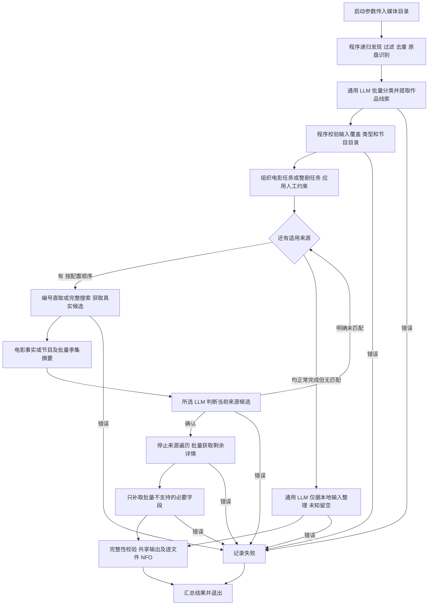

# 项目清理、AI 分类、批量整改与验证方案

> 执行时使用 `superpowers:executing-plans` 逐项推进。每一步先完成验证并汇报，通过且没有关键歧义后继续；截至本次提交，阶段一至三已实现并通过完整测试；按最新要求，先提交并合并到 master，再在主分支进行阶段四最终复验，随后执行阶段五真实样本。真实样本尚未运行。

**目标：** 清理失效能力，改为从启动参数接收媒体目录并一次性处理；由 AI 判断电影或剧集及作品归属，完成整剧批量刮削或受限本地整理，验证 res.txt 固定样本与 res2.txt 新集合。

**架构：** 沿用现有包结构。程序负责递归发现视频、明确过滤、路径去重与原盘结构识别；通用 LLM 在没有预设类型的情况下批量判断类型、作品归属和季集关系；程序校验后组织电影任务或整剧任务，所选判断模型按来源统一选择作品。TMDb 使用官方 API 批量组合资源，TheTVDB 合并公开全集页与季页面；只有所需字段确实无法批量取得时才补取单集页。全部适用来源正常执行且没有确认匹配时，通用 LLM 仅依据目录和文件名整理本地元数据，未知事实留空。

**技术栈：** 现有 Go 1.27+、HTTP 客户端、HTML 解析、XML 写入器及测试框架；不新增框架或外部媒体工具。

**依据：** [统一设计](../../metadata-providers.md)、[平台批量能力实测](../../provider-batching-research.md)、[四端 NFO 核查](../../nfo-recognition-audit.md)。统一设计规定目标行为，本文件规定本轮顺序与验收，调研报告保留事实依据。

## 1. 范围与当前状态

| 工作 | 当前状态 | 本轮处理 |
| --- | --- | --- |
| TMDb、TheTVDB、多 LLM、有序来源、电影与剧集、四端 NFO 字段修复 | 基础实现已存在 | 保留能力，调整剧集任务与取数粒度 |
| 失效仓库文件清理 | 已在工作目录完成，尚未提交 | 复核并纳入最终变更，不重复执行 |
| 原始目录复现 | 已完成 | 复用 98 部节目、5,419 个空视频文件，不复制已有元数据 |
| 平台批量能力调研 | 已完成 | 按真实响应实现，不继续假设单集扩展字段只能逐集获取 |
| 一次性 CLI、AI 分类与整剧批量处理 | 已实现并通过受控回归 | 移除运行模式及目录类型配置，启动参数决定扫描范围，AI 决定媒体类型 |
| 固定 10 部节目真实刮削 | 尚未执行 | 整改及受控回归通过后运行 |
| res2.txt 本地内容集合 | 已完成清单核查，尚未复现和运行 | 529 个视频，覆盖相声、评书、专场、年度目录和分段文件；验证无匹配后的 AI 本地整理 |

整合后的约束：

- 仅支持电影和剧集。ffmpeg、ffprobe、音乐视频、Kodi JSON-RPC、匹配/搜索模式和规则回退继续移除。
- LLM 负责识别与选择；有来源匹配时，最终事实只来自被选中的来源。全部适用来源正常完成却无匹配时，允许用户已确认的 AI 本地整理，仅使用目录和文件名中的信息，未知事实留空，不用模型知识补写剧情或人物。请求错误不触发此分支。
- 具名模型列表及独立刮削配置继续使用；判断模型可选 Jev 或 OpenAI 兼容模型，不新增“批量/单集模式”开关。
- 仅保留一次性扫描；删除监听、定时调度和运行模式。保留明确过滤、原盘结构识别与人工来源/季集约束。电影/剧集由 AI 判断，不能由目录配置、用户样本答案或文件名关键词写死。
- 保留 NFO 已修复字段与图片布局，不因批量取数而默默减少演员、翻译、跨站编号等现有输出。
- 四端识别继续按官方文档与源码核查；空视频只验证刮削、路径和输出，不验证播放或实际媒体服务器导入。
- 本轮不重新改写 Git 历史，不清理项目外的归档仓库或其他工作区，不接触真实媒体库。

## 2. 清理方案

### 已完成的清理

| 文件 | 删除或调整的原因 |
| --- | --- |
| 根目录 `task_plan.md`、`findings.md`、`progress.md` | 上轮过程记录包含旧配置、旧工作区和“尚未提交”等过期状态；正式设计和审计已保留有效结论 |
| `.gitea/workflows/deploy.yml` | 只转调用原作者的个人部署仓库，不是本仓库当前使用的 GitHub 发布流程 |
| `.gitignore` | 忽略用户输入 `res.txt`、`res2.txt` 和本地 `.validation/` 目录，避免将媒体清单、私有配置和验证产物纳入提交 |
| 正式设计与审计文档 | 修复上述删除带来的引用，并区分历史验证与当前待实施工作 |

源码、有效测试、NFO 示例、LICENSE、Makefile、GitHub 发布流程继续保留。已有完整测试的 15 个测试包、文档链接及差异检查通过。

### 随整改完成的代码清理

- 统一 CLI 和 AI 分类链路接通后，删除目录决定类型、向提取模型预填电影/剧集类型、旧逐集剧集提取与候选绑定、重复节目输出代码，同时改写相关测试。
- 删除 `collector/watcher.go`、`common/watcher/`、定时扫描、守护进程、当前目录专用模式及 watcher 注册调用。移除监听库 fsnotify；lrace 当前仅用于旧运行模式三元表达式，确认无剩余调用后删除依赖并运行 go mod tidy。
- TMDb 生产路径移除默认逐集独立 HTTP 请求；保留单集事实结构及其 NFO 映射，因为批量结果仍由多个单集构成。
- TheTVDB 单集页面解析继续保留，用于已证实无法批量取得的字段；删除每次补取单集前重新读取节目页的调用。
- 不凭名称或文本引用数直接删代码；每项删除均检查生产入口、接口实现、测试 fixture、文档和发布消费者。

## 3. 一次性入口、AI 分类与处理契约

### 启动与配置

媒体路径是本次要求扫描的一个目录，只能通过 --path 指定一次；程序递归处理其中所有受支持且未被明确过滤的视频，处理结束即退出。媒体路径仅来自命令行 --path 参数，位置参数和重复 --path 均拒绝，不再读取配置目录，也不默认扫描当前目录。

目标命令格式：

```sh
./kodi-tmdb -config config.json --path "/media/混合媒体库"
```

`-config` 继续指定模型、数据源、过滤和日志配置文件。`-version`、帮助入口保留。没有媒体目录、目录不存在或无法读取、传入旧运行模式参数时明确失败，不启动模型和来源请求；配置和输入均有效但没有符合条件的视频时正常退出并报告零条；空目录不绕过所选模型与来源配置校验。

| 移除项 | 原定义与移除原因 |
| --- | --- |
| `collector.movies_dir` | 原电影库根目录数组，曾决定目录内视频按电影处理；删除，因为路径改由启动参数传入，类型改由 AI 判断 |
| `collector.shows_dir` | 原剧集库根目录数组，曾决定目录内视频按剧集处理；删除，原因同上 |
| `collector.run_mode` | 原常驻、单次扫描、当前目录扫描的模式编号；删除，因为只保留一次性执行 |
| `-mode` | 原命令行运行模式覆盖参数；删除，因为不存在模式选择 |
| `collector.watcher` | 原文件监听开关；删除，因为程序处理完本次输入即退出 |
| `collector.cron_scan` | 原定时扫描开关；删除，因为不再内置周期任务 |
| `collector.cron_scan_boot` | 原守护启动时是否扫描的开关；删除，因为启动就执行唯一的一次扫描 |
| `collector.cron_seconds` | 原定时扫描间隔秒数；删除，因为不再存在定时循环 |
| `MediaFile.TaskType` 及对应枚举 | 原区分扫描、指定目录和监听任务来源；删除，因为只有一个任务入口 |
| `ParseInput.MediaType` 的预填用途 | 原在调用模型前由代码告诉模型电影或剧集；移除预设输入，改为由模型返回类型并接受程序校验 |

不新增此前曾建议的统一目录配置 `collector.media_dirs`（其含义是配置文件中的媒体根目录数组），因为媒体路径的唯一入口已经确定为启动参数。旧字段必须严格拒绝，不提供兼容读取。`collector` 只保留既有明确过滤设置：`skip_folders` 指排除目录名，`skip_keywords` 指用户指定的排除文件名关键词，`tmp_suffix` 指临时下载后缀。它们不得用于推断电影/剧集；日志输出模式与本次删除的运行模式无关，保持原义。

### 程序与 AI 的职责

| 工作 | 归属与边界 |
| --- | --- |
| 遍历目录、读取文件名、识别支持的视频扩展名 | 程序执行；不读取视频内容，不执行目录中的脚本 |
| 排除 NFO、图片、脚本、临时下载文件及用户明确排除项 | 程序执行；保留排除原因和计数 |
| 单个输入目录内的媒体路径去重 | 程序按路径包含关系和规范化媒体路径处理；同一路径不重复派发，不按文件名相似度或内容猜测去重 |
| BDMV、VIDEO_TS 等原盘结构 | 程序识别为一个媒体单元，内部流文件不重复派发；封装结构本身不决定电影或剧集 |
| 电影/剧集、作品归属、季集线索 | 通用 LLM 批量判断；不写作品名、演员名、年份目录或专场名称的分类特例 |
| 正片、预告、花絮、样片等内容性质 | AI 分析；移除代码内凭 sample/trailer 等命名自动归类的语义判断，不能据此擅自新增整类视频跳过策略 |
| 是否执行排除、验证输出路径、写 NFO | 程序按明确规则执行；未被明确排除的视频仍纳入处理，模型不能删除文件或扩大文件系统访问范围 |

“所有视频”指本次目录中符合支持范围、通过明确过滤的视频；每项排除单独计数。原盘识别和临时后缀判断是结构规则，不是基于片名推断类型的规则。不同文件路径的不同版本继续保留，来源事实可以复用，NFO 分别生成。

### 批量输入与类型协议

程序先构建尚未确定类型的媒体清单及目录上下文，再调用 `scraper.extract_llm` 引用的通用模型。每批最多 50 个媒体单元，每个批次只使用一个扫描根作为路径上下文；同一目录可以同时存在电影和剧集，不能把整个目录预设成一种类型。模型一次返回类型及作品线索，后续电影/剧集处理器消费已校验结果，不再各自调用一次预设类型的提取。

批量协议改用通用条目列表，替代上一版只适用于剧集的 episodes 列表。新增和替代字段含义如下：

| 字段 | 定义、用途与新增/替代原因 |
| --- | --- |
| `files[].relative_path` | 输入媒体相对其扫描根目录的原始路径；由程序生成，用于本次文件覆盖校验，不预设电影或剧集 |
| `items[].relative_path` | 模型结果引用的输入媒体路径；替代仅包含单集的结果路径字段，必须属于当前批次且恰好出现一次，不能决定输出文件名 |
| `items[].media_type` | 模型判断的组织类型：movie 为独立作品/独立长视频，tv 为剧集单集；null 表示未能判定，须报告识别失败，不能默认电影，也不是新增第三种媒体类型 |
| `items[].series_root` | tv 条目所引用的现有节目目录，相对其扫描根目录，`.` 表示扫描根本身；movie 留空。新增用于在统一目录扫描后归集跨季文件，必须存在、位于输入范围并包含对应视频，不能虚构目录或跨根写入 |
| `items[].season` | tv 条目的非负季号，未知为 null，零季仍是特别篇；movie 必须为 null，替代旧单集专用结果中的季号字段 |
| `items[].episode` | tv 条目的正集号，未知为 null；movie 必须为 null。不能将年份、日期或分段编号机械转换成集号 |
| `items[].episode_title` | 文件上下文中的单集标题线索，只有 tv 使用；不是最终 NFO 标题事实 |
| `items[].content_role` | 输入表现出的内容性质：main 为正片、trailer 为预告、extra 为花絮、sample 为样片，未知为 null；用于说明和核验语义判断，不自动授权跳过文件 |
| `items[].tmdb_id` | 该条目所属电影或节目在 TMDb 的记录编号提示，类型取决于已返回的 media_type；不允许填演员、季或单集编号，未知留空 |
| `items[].thetvdb_id` | tv 条目所属节目在 TheTVDB 的记录编号提示；movie 留空，不允许填季或单集编号 |
| `Option.Episodes` | 替代内部 `Option.Episode`（原先绑定一个目标单集的实际详情），保存同一节目候选涉及的同来源单集事实集合；电影候选为空集合 |

未知/重复/遗漏输入路径、非法类型、movie 混入季集、无效节目目录、同组批间身份冲突均报告失败，不能靠规则重新判定以掩盖模型错误。未识别类型时不请求网站、不写 NFO。tv 类型明确但季集未知时只允许既有人工约束补足，不伪造季集；movie 不要求季集。

### 分组、约束和来源判断

程序仅在 AI 分类完成后组织任务：电影按独立作品处理，tv 按核验后的现有节目目录和一致作品身份归集多季多集。同一目录不是同一作品的充分条件；归组必须与各文件的模型结果一致。多个节目若无法在现有目录内形成互不冲突的 tvshow.nfo 输出位置，则报告目录组织冲突，不自行移动文件或创建新节目目录。

网站节目编号表示节目记录，网站单集编号表示单集记录；季集坐标只是对应节目指定编排内的位置。现有 `Ref.Provider` 表示来源名称，`Ref.Kind` 表示电影/节目/单集对象类型，`Ref.ID` 是该来源、该对象类型内的记录编号；`Ref.Slug` 只负责定位 TheTVDB 节目网页。程序使用已核验的媒体类型选择 TMDb 电影或剧集接口，以及来源支持范围，不由数据源顺序反推类型。

人工来源文件仍是约束而非分类替代：`id.txt` 中的 TMDb 作品编号按已经识别的电影或节目类型核验；`season.txt` 指定该目录视频的季号；`group.txt` 指定 TMDb Episode Group 分组记录编号；`join.txt` 换算已知季集坐标。各文件原作用域保留，人工要求与 AI 类型冲突时报告冲突，不能悄悄改变模型结果。不同季的设置不得互相覆盖。

同一轮剧集任务、每个实际有候选的来源，只调用一次所选候选判断模型。候选证据包含节目事实及涉及季集的去重摘要，不发送图库和完整演职员列表。节目确认后，其余详情获取和 NFO 输出不再重复判断；不同本地版本对应同一来源单集时复用事实。

### 完整流程



全部适用来源正常完成且无确认匹配时才进入 AI 本地整理。类型不明、约束冲突、模型错误、请求错误、响应缺项均停止该任务，不当作无匹配，不切换模型或把批量错误转为逐集请求。来源确认后发现数据缺口，不用另一来源或 AI 混合补齐。人工明确指定作品失败也不转入本地整理。

一次运行不驻留、不监听新增文件、不创建定时器。处理失败在最终汇总中可见，退出非零；独立任务已经成功的输出如实保留，不承诺跨文件事务回滚。每个纳入的视频必须落入成功或明确失败统计，不能漏项后返回成功。

### 数据源无匹配后的 AI 本地整理

该分支由用户新增 res2.txt 时明确授权，不是对请求失败的降级处理。不能预设 res2.txt 全部不存在于网站，也不能跳过已配置且适用的数据源。

- 模型复用 `scraper.extract_llm` 引用的通用 OpenAI 兼容实例；Jev 仍只负责候选判断。本地整理没有网站候选，不再让 Jev 选择虚构候选，也不新增第三个网站 Provider 或匹配模式。
- 按节目或已确定的独立视频集合批量整理，沿用每批最多 50 个文件及路径覆盖校验；不重新逐文件识别、搜索网站。
- 可输出标题、明确的季集坐标、能够由输入支持的分类和简短描述。只有 `S01E01` 时可整理为“第 1 集”，不能编写具体单集故事。无法支持的分类也留空。
- 不输出模型猜测的演员、角色、评分、时长、制作信息、播出日期、海报地址或网站编号。文件中的年份/日期可以保留在标题和简短描述中，但不能未经语义确认写成首播日期。
- 本地简介明确说明“依据目录和文件名整理”，避免被当成网站提供或视频内容分析。模型不分析视频内容、不探测媒体流、不生成图片。
- 所有目录中的脚本、已有 NFO、图片和缓存均不是执行指令；res2.txt 中的 `rename.sh`、`concat.sh`、`ff-copy.sh` 不执行、不复制为测试媒体。

本地身份沿用现有引用结构，但明确扩展含义：`Ref.Provider=local` 表示本工具的本地条目命名空间，不代表任何网站；`Ref.ID` 在此命名空间内表示程序生成的本地条目标识，不由 AI 提供。节目按规范化节目目录和对象类型生成稳定摘要，单集按该节目身份与明确季集坐标生成，独立视频按规范化文件路径和对象类型生成。同一路径重复运行保持一致；不同本地版本对应同一个明确单集时共享单集身份，不承诺移动或改名后的身份不变。

NFO 的 `uniqueid` 表示当前对象的唯一标识；本地条目使用 `type="local"` 与上述程序生成的值，不填写虚构的 tmdb/tvdb/imdb 类型编号。`Record.ExternalIDs`（当前对象在其他网站的已核实记录编号集合）及 `Record.SourceURL`（真实来源页面地址）在本地整理结果中保持空。[Kodi 官方文档](https://kodi.wiki/view/NFO_files/TV_shows#nfo_Tags)允许非网站作品使用自定义唯一标识类型；Jellyfin、Emby、Silo 对本地类型的接受或忽略行为需列入本轮源码核查，不能假装已完成四端验证。

## 4. 两个来源的取数方案

### TMDb：官方 API 批量组合

1. 从节目详情 API 发起组合请求；先取候选节目事实和涉及季的单集数组，判断阶段不请求所有候选的完整演职员与图片集合。
2. 节目确认后，收集仍未取得的单集演职员、图库及同对象跨站编号路径，去重后继续使用节目 API 追加获取。
3. 每批最多 20 个追加对象，季资源、节目扩展资源和单集扩展资源共同占用额度。超过 20 拆批，不限制整部剧季数，不把 20 解释为集数。
4. 校验每个追加对象实际存在及其归属；HTTP 200 但缺少请求对象必须报错。季的演员或跨站编号不能填入单集。
5. 分组编排先读取所需分组事实，每个不同分组只取一次，再把本地位置映射为官方季集坐标，批取后保留应输出的编排坐标。

`append_to_response` 是 TMDb 合并子资源的查询参数。单集 `credits` 表示该集演职员，`images` 表示该集图库，`external_ids` 表示该集在其他网站的记录编号；这些字段已证实能在节目 API 下批量获取。本轮不以缺少旧解析代码为理由改回单集请求。

### TheTVDB：公开网页批量合并

1. 同一节目页取一次，全集页取一次；解析各集正式季集号、单集记录编号、标题、简介、日期、电视网及 `data-src` 中的剧照地址。
2. 本地涉及的各季页面各取一次，补齐每集时长；使用同一节目下的 TheTVDB 单集记录编号关联，并交叉核对季集号。
3. 保持现有语言和跨站编号输出契约。批量页面不能提供的目标语言翻译、单集跨站编号，才补取对应单集详情页；同一单集只补取一次。
4. 详情补取直接使用已验证的单集链接，不重读节目页或全集页，不再次搜索和判断节目。
5. 来源明确没有的可选字段保持缺失，不因为空值反复请求；网页结构、重复坐标、跨节目链接等异常必须报告。

现有中文配置下，某些节目可能仍需为多数单集补取翻译或跨站编号。报告必须如实展示补取原因和次数，不能承诺所有字段都能仅用一张全集页取得。

## 5. 分步整改与验收

每个代码阶段遵循“建立失败回归 → 运行确认失败 → 最小实现 → 运行确认通过 → 汇报结果”。不保留可切回旧逐集流程的兼容入口。

### 阶段一：文件清理复核

涉及 `.gitignore`、已删除的三份过程文档、Gitea 工作流及正式文档引用。

- [x] 确认失效文件及消费者，完成明确范围内的删除。
- [x] 完整测试 15 个测试包、文档本地链接、`git diff --check` 通过。
- [x] 交付前再次核对，保证 config.json、配置编辑临时文件、res.txt、res2.txt、验证产物未进入暂存或提交；不删除用户正在编辑的文件。

### 阶段二：来源批量能力及数据契约

主要修改 `tmdb/provider.go`、`tmdb/provider_record.go`、`tmdb/provider_group.go`、`thetvdb/provider.go`、`thetvdb/html.go`；批量请求规划分别放入新增的 `tmdb/provider_batch.go`、`thetvdb/series.go`，共享批量事实契约放在现有 `metadata` 包。此阶段先通过来源级测试确认新函数，不切换生产任务入口；阶段三一次性接通整剧链路并删除旧入口，不新增两种运行模式。

批量函数接收同一来源的节目引用以及本轮涉及的去重季集与分组约束，返回节目事实和对应单集事实集合；电影仍按现有对象获取。节目引用与各单集引用遵守第 3 节定义，返回值不能混用父对象身份。

- [x] 建立受控 HTTP 计数测试，再实现两来源批量函数。21 个唯一追加资源必须发两批，禁止发出 21 项请求；不得改成 21 次独立单集请求。
- [x] TMDb 覆盖跨季取数、扩展字段等价、追加缺项、对象错误、分组坐标和去重。
- [x] TheTVDB 覆盖全集简介/图片、季页面时长、按单集记录关联、缺翻译/跨站编号补取及补取理由，确保不重复取节目页。
- [x] 候选阶段支持取得节目和季集基本事实；节目选中后才批取其余扩展字段，避免为所有候选下载完整图库和演职员。
- [x] 来源级单测全部通过，同时确认现有电影和剧集基线仍可编译运行；不把新增批量函数误报为生产流程已切换。

```sh
go test ./metadata ./tmdb ./thetvdb -count=1 -timeout=90s
go test ./... -count=1 -timeout=90s
```

### 阶段三：一次性 CLI、AI 分类、作品任务与输出统一接通

主要修改 `main.go`、`config/struct.go`、`config/config.go`、`config/defaults.go`、`config/constants.go`、`collector/collector.go`、`collector/scan.go`、`collector/filter.go`、`collector/process.go`、`media_file/media_file.go`、`media_file/struct.go`、`movies/process.go`、`movies/pipeline.go`、`shows/process.go`、`shows/process_struct.go`、`shows/override.go`、`shows/pipeline.go`、`common/ai/struct.go`、`common/ai/ai.go`、`metadata/types.go`、`metadata/manager.go`、`metadata/cache.go`、`metadata/evidence.go`、`common/ai/judge.go`、`common/jev/evidence.go`、`providers/providers.go`，删除两处 watcher 实现并更新相应测试。`example.config.json`、README 和依赖文件在同一阶段同步切换，避免配置先变而程序仍读取旧入口。

这一阶段同步替换启动参数、配置校验、未分类媒体清单、AI 协议、候选集合、全部调用方和输出路径；不保留目录强制类型或旧运行模式入口。字段含义以第 3 节为准；来源通过阶段二已验证的批量函数提供事实。

- [x] 补全失败回归：同一目录混合电影和剧集，由受控 AI 响应决定派发；一部剧两季多集归为一个任务；51 个输入分成 50＋1，恰好覆盖一次；重复、遗漏、未知路径、非法类型和身份冲突拒绝。
- [x] CLI 回归覆盖单个 --path、重复参数/位置参数拒绝、递归子目录、路径去重、无参数、无效/不可读路径、零视频、旧参数和旧配置拒绝。除了版本/帮助入口，缺少路径不得默认扫描当前目录或调用外部服务。
- [x] 扫描仅生成未分类媒体清单；全部相关分类批次校验后，再按 AI 类型组织作品任务。电影/剧集处理器消费已有识别结果，不再次发送预填媒体类型的提取请求。
- [x] 删除监听、定时扫描、守护进程和指定目录模式分支，以及只服务多入口的状态与依赖；任务完成后关闭有限队列并退出，没有遗留监听器或周期 goroutine。
- [x] 提取、人工约束、两种判断器统一消费节目身份与文件映射；单次判断选择节目候选，移除旧单集候选协议并接入两来源批量函数。
- [x] 单个候选仍需判断；首个来源确认后，后续来源请求为零。不得因批量改造截断来源候选或改变错误规则。
- [x] 实现仅在全部适用来源正常完成且无确认匹配时触发的本地整理，复用通用模型实例；增加无匹配、请求错误、人工指定失败的区分测试，错误路径不得转入本地整理。
- [x] 校验本地整理字段白名单、未知事实省略、描述依据说明和程序生成的本地身份；网站匹配成功的记录禁止混入模型生成事实。直接复用统一 NFO 写入器，不能通过伪造网站编号满足现有非空校验。
- [x] 同一任务内复用已取得事实；关闭磁盘缓存也不能导致同任务重复请求。磁盘缓存继续隔离来源、语言、作品与编排，批量结构变化时更新缓存版本。
- [x] 完成本轮全部文件映射与必需事实校验后再输出。节目 NFO 与共有图片按任务处理一次，各单集按原文件路径输出；多个本地版本共用事实并分别生成 NFO。
- [x] 保留零季、来源分钟时长、当前对象网站编号、中文/XML 转义、图片命名与原盘布局；复用 `nfo/write.go` 和 `artwork/download.go`，不恢复媒体流字段。
- [x] 删除旧剧集逐文件生产入口及其独占函数，同步替换测试断言；不保留可切回旧流程的配置或包装入口。
- [x] 验证相对/绝对 CLI 路径、嵌套去重、混合目录、根目录独立视频、原盘只处理一次及人工季/分组/join 约束；不通过电影/剧集目录配置组织测试。

```sh
go test ./config ./collector ./media_file ./common/ai ./common/jev ./movies ./shows ./metadata ./providers ./nfo ./artwork -count=1 -timeout=90s
go test ./... -count=1 -timeout=90s
```

### 阶段四：完整复核与跨平台检查

- [ ] 检查生产源码与调用关系，确认没有运行模式、配置媒体目录、监听/定时调度、预设媒体类型、按样本名字分类、逐视频独立选择节目或默认逐集调用 TMDb 详情的残留。
- [ ] 搜索生产代码和生产提示词，确保没有验证标签文件、针对 res2 样本名字的类型分支或“这些样本就是电影”的答案提示；用户答案只存在于隔离的验证期望中。
- [ ] 请求计数由实际请求执行边界累计，节目流程汇总提取批次、判断次数、来源批次及详情补取原因；验证器汇总成报告。缓存命中不能计为外发请求，重试与首次请求分别计数；统计发现数量、明确排除、AI 分类与未分类、归组、输出成功与失败，保证数量闭合。
- [ ] 观测归属限定在任务编排与请求执行边界；纯模型、常量和协议结构不输出日志。复用现有日志入口，不以此次验收为理由迁移整个日志系统；只记录脱敏路径或来源信息、阶段、数量、耗时及原始错误，不输出认证参数。
- [ ] 单文件原子替换边界不变；后续图片或文件写入失败时报告失败，不承诺整部剧多文件事务回滚。
- [ ] 全量 race、vet、平台构建、正式文档与方案的本地链接检查通过，更新 README 中的真实行为和仍未覆盖的验收范围。

```sh
go test -race ./... -count=1 -timeout=90s
go vet ./...
go build -o .validation/res-20260924/kodi-tmdb .
CGO_ENABLED=0 GOOS=linux GOARCH=amd64 go build -o .validation/res-20260924/kodi-tmdb-linux-amd64 .
CGO_ENABLED=0 GOOS=linux GOARCH=arm64 go build -o .validation/res-20260924/kodi-tmdb-linux-arm64 .
CGO_ENABLED=0 GOOS=windows GOARCH=amd64 go build -o .validation/res-20260924/kodi-tmdb-windows-amd64.exe .
git diff --check
```

### 阶段五：网站样本与本地内容样本分别验证

#### A 组：res.txt 固定 10 部节目

完整副本和原始抽样清单位于 `.validation/res-20260924/`，原始 tree 清单哈希与随机种子已经记录。随机种子为 `456881182`，不重新抽样。

| 节目目录简称 | 输入视频数 |
| --- | ---: |
| Candle.In.The.Tomb-The.Weasel.Grave | 20 |
| 人是铁饭是钢 | 32 |
| Super.Science | 8 |
| 超級全能住宅改造王 | 104 |
| Friends | 234 |
| 我们的歌 | 14 |
| 西游记 2011 | 60 |
| 亮剑 | 30 |
| The Rap of China | 13 |
| Man.vs.Wild | 55 |
| 合计 | 570 |

- [ ] 复核 5,419 个原始视频路径集合，所有占位视频仍为空；本轮初始输入没有复制原有的 5,822 个 NFO、图片、缓存或人工覆盖文件。
- [ ] 从执行时的项目 config.json 派生私有测试配置，保留服务地址、模型、凭据、语言、来源顺序、门槛和过滤设置；删除第 3 节列出的旧目录与运行配置，日志指向验证目录。媒体副本目录通过 CLI 参数传入，原配置不由验证器改写。
- [ ] 按样本顺序逐部运行，第一部作为链路检查，成功后继续剩余九部。共享的鉴权、网络或协议故障先停止并诊断，不用其余样本重复消耗请求，也不换模型、数据源顺序或样本掩盖问题。
- [ ] 每部包含目录内所有原始视频，继续应用现有过滤规则。记录“输入 570、按规则排除、实际纳入、成功、失败”的计数，不默认每个输入都应输出 NFO。
- [ ] 单次程序失败必须有非零退出码和具体失败阶段；对有效输入未生成 NFO 的情况不得算作通过。匹配结果与目录明显冲突、未知季集、来源数据缺失都保留为失败证据。
- [ ] 检查全部生成 XML 的根元素、节目与单集来源归属、季集映射、来源时长及图片文件非空；人工复核每部节目与多季边界、特别篇和非标准文件名。
- [ ] 输出脱敏报告，按节目记录来源、提取批次数、候选判断次数、批量请求次数、单集补取次数及原因、纳入文件和 NFO 数量、失败阶段和原因。不得记录凭据或带认证参数的完整 URL。

真实验证使用已配置的来源顺序，不为覆盖另一个 Provider 而改动配置。两种判断器和两个 Provider 的机制覆盖由受控回归保证；真实报告明确本次实际走过哪些服务。

#### B 组：res2.txt 新增待验证集合

该组增加本地编目边界验证，不替换 A 组固定样本。已解析 529 个视频和 5 个非视频文件，尚未创建视频副本、执行网站检索或调用 LLM；“几乎找不到”是用户提供的样本特征，实际是否无匹配由运行证据判断。

| 顶层目录或独立条目 | 视频数 | 验证重点 |
| --- | ---: | --- |
| 全本张广泰回家 | 23 | 只有作品名与季集号，不编写未知单集剧情 |
| 冯天奇闹通州墨尔本专场 | 4 | 专场标题、明确季集及无网站编号时的本地 NFO |
| 坑王驾到 | 260 | 4 季、详细单集标题与只有编号的文件并存；不能预设无来源匹配 |
| 德云社 | 196 | 2014—2021 年目录、日期命名、年度专场、上下部分段；不把年份擅自改成季号 |
| 德云社封箱 | 10 | 年份及 part1/part2/part4，不能凭文件顺序生成集号或补造缺少的 part3 |
| 老郭有新番 | 30 | 作品名、季集号与年份，验证节目事实和文件年份的区别 |
| 郭德纲 相声 专场集粹 | 5 | 合集标题及明确季集，不能编造每集曲目和出演名单 |
| 根目录“德云社20周年庆典”独立视频 | 1 | 无季集号的独立条目，不误挂到任一节目 |
| 合计 | 529 | 7 个目录集合共 528 个视频，另有 1 个根目录视频 |

- [ ] 完整保留该组原文件名与目录关系，创建空视频副本；忽略清单自身和 4 个脚本，记录清单哈希，不执行脚本。
- [ ] 年度专场、封箱及根目录视频一律先由 AI 分类。已在忽略目录的 expected-media-types.json 保存 4 个用户确认示例；其中 expected_media_type 定义人工期望的电影/剧集组织类型，只供验证器比较，新增原因是将人工答案与模型输入隔离。它不进入生产规则、目录配置或提示词；AI 判错时报告分类失败，不能事后用文件名特例纠正成预期答案。
- [ ] 类型和归组通过校验后，tv 进入整剧批量任务，movie 进入独立作品任务；不能把有编号自动视为剧集或把无编号自动视为电影。来源匹配使用网站事实，所有适用来源正常无匹配才进行本地整理。
- [ ] 统计 AI 分类、归组、网站匹配、本地整理、配置/网络失败、输入不足等结果；分类与人工预期对照独立记录。不能把生成 NFO 等同于类型正确或准确匹配，也不能把电影组织形式当作内容一定是院线电影。
- [ ] 检查本地 NFO 的标题、季集和描述能追溯到输入；未出现的演员、评分、时长、日期、图片和网站编号必须不存在。本地身份重复运行稳定。
- [ ] 增加包含本地唯一标识、无网站编号、无图片及缺少可选事实的 movie/tvshow/episodedetails 样本，按官方文档与源码核查四端识别，不恢复媒体流探测。

## 6. 关键验收矩阵

| 场景 | 必须满足的结果 |
| --- | --- |
| 单次执行和路径参数 | 递归处理传入目录后退出；无路径/无效路径失败；不读配置媒体目录、不驻留 |
| 同一目录混合媒体 | AI 决定 movie/tv，程序按结果派发；目录名字不决定类型 |
| 重复发现的媒体路径与原盘内部流文件 | 同一媒体单元只发现一次；原盘结构不决定电影/剧集 |
| 用户已确认的专场样本 | 期望 movie 仅由验证器比对；生产代码及提示词没有样本特例 |
| AI 返回未识别类型 | 报告识别失败，不默认类型、不请求网站、不生成 NFO |
| 同一轮扫描的两季多集 | AI 归组后形成一个节目任务；每个有候选来源一次判断；节目 NFO 一次 |
| 51 个文件的批量提取 | 两批 50＋1；输入与输出路径集合完全相等，无逐集调用 |
| 同一单集两个本地版本 | 两份单集 NFO，一份来源事实获取 |
| TMDb 20/21 个追加对象 | 一批/两批，每批不超过 20；不是 20/21 次单集详情请求 |
| TMDb HTTP 200 但缺一个追加对象 | 明确失败，不视为完整响应，不自动逐集补请求 |
| TheTVDB 批量数据已覆盖所需字段 | 不请求这些字段的单集详情 |
| TheTVDB 目标语言或跨站编号无法批量取得 | 只补取对应单集页；节目页和全集页不重复取 |
| 来源提供空的可选字段 | 按来源事实省略，不凭空补造或无限补取 |
| 首个来源确认 | 后续来源零请求，输出保持同一来源 |
| 全部适用来源正常完成且无匹配 | 通用 LLM 基于输入批量整理本地元数据；未知事实留空，使用程序生成的本地身份 |
| 鉴权/网络/协议故障或人工指定失败 | 明确失败，不触发 AI 本地整理 |
| 只有作品名和 S01E01 | 保留作品名与明确季集，可使用中性单集标题；不编造具体故事、演员、时长或网站编号 |
| 本地唯一标识 | 同一路径重复运行稳定；明确 local 命名空间，不冒充网站编号 |
| 年份目录、日期和分段文件 | AI 分析类型与归属；不能用名称特例强制电影，也不能擅自把年份/日期/part 编号当成季集 |
| 人工约束冲突、未知季集或模型漏文件 | 明确失败，尚未开始 NFO 输出 |
| 有效配置和输入目录内零视频 | 报告零条并正常退出，不调用模型或来源；配置错误仍须失败 |
| 子目录不可读或扫描不完整 | 明确失败，不能只记日志后冒充扫描成功 |
| 写入阶段失败 | 单文件无半成品，运行失败；已有成功文件如实报告 |
| 四端 NFO | 已核查的读取字段与布局不退化；不把 XML 测试当成媒体服务器导入验收 |

## 7. 交付边界

交付代码清理、一次性 CLI、AI 分类与批量改造、更新后的配置说明与统一设计、测试证据及两组样本的分类/编目报告。私有配置、媒体清单、完整目录副本、真实响应及运行日志保留在忽略目录。

当前方案已根据现有调用链和平台实测进行启动输入、AI 分类、任务归组、来源获取、输出、退出及请求数量的逐分支静态核对；一次性 CLI、业务代码整改及两组真实样本验证仍待执行，不能用此前逐集实现的测试通过结论代替。
